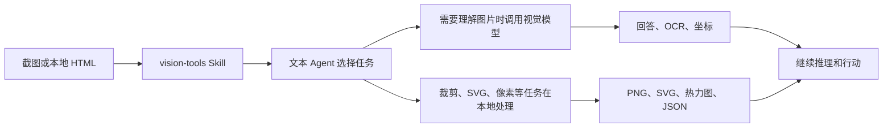

<p align="center">
  
</p>

<div align="center">

# DSH Vision Toolkit

[](https://dshfind.com/zh/plugins/Anionex/dsh-vision-toolkit)
[](https://dshfind.com/zh/plugins/Anionex/dsh-vision-toolkit)
[](https://www.npmjs.com/package/@anionex/dsh-vision-toolkit)
[](LICENSE)
[](cordis.patch.yml)

**更强大的视觉工具箱——给 DeepSeek Harness 里的纯文本模型装上眼睛：图片问答、长图 OCR、前端 UI 还原、GUI 视觉任务，一套视觉工具箱和一个 Skill。**

🚀 粘贴图片，直接提问 ｜ 一行命令安装即用 ｜ 内置免费视觉 ｜ 场景丰富

🌐 [English](README.md) ｜ **中文**

</div>

如果你在 dsh 中使用 DeepSeek 等纯文本模型，遇到了下面问题中的一个或者多个，那么这个插件适合你：
1. 粘贴图片被拒绝，不能发图片给模型，还要手动切换模型。
2. 模型看不到图片内容，不能做和图片有关的任务。
3. 已有方案只能得到图片笼统描述，完成不了高难度视觉相关任务，例如ui还原，长截图分析等。
4. 不能安装即用，直接体验，还要自己配置api key。

🏆 本项目为deepseek harness生态首个综合性视觉工具插件：内测前已立项，并在内测期间参考本人的[`agent-vision-toolkit`](https://github.com/Anionex/agent-vision-toolkit)做出

> **原创声明：** 这套视觉工具的体系和划分方式，以及 `vision-tools` Skill，均由作者个人原创并持续打磨，相关工具、方法和工作流来自长期的真实使用与反复迭代。

## 亮点

- **粘贴即可使用。** 在 DSH Web 里粘贴图片，文本模型会自动切换到看图模式变体，不需要手动复制路径或更换模型。
- **无缝体验。** 图片保留原生缩略图、会话记录和工作区路径；Web 可以预览产物，Headless 也能继续使用同一份结构化结果。
- **一行命令安装即用。** 安装插件后默认使用内置免费 Gemini 3.7 Flash 视觉服务，不需要申请 API Key。
- **内置免费视觉。** 安装后即可直接使用共享服务；共享容量暂时用尽时，会返回带重试提示的明确 `429` 响应。
- **带着意图去看图。** Agent 不只生成通用描述，而是围绕“报错在哪里”“按钮在哪”等当前任务提取证据。
- **从截图到可验证结果。** 参考图、HTML 截图、差异定位和像素对比组成一条完整 UI 还原闭环。


[`agent-vision-toolkit`](https://github.com/Anionex/agent-vision-toolkit) 的视觉能力不只停留在图片描述：Agent 可以读取、定位、裁剪、描摹、还原和验证视觉内容。DSH Vision Toolkit 是这套工具箱面向 DeepSeek Harness 的原生接入，让它进入 Web 和 Headless Profile。

本项目提供两层能力：

1. **视觉工具和 Skill**：让 Agent 知道什么时候该看图、定位、OCR、裁剪、描摹或做像素对比。
2. **DSH 原生接入**：把这些能力放进 Profile、会话、Settings、Artifacts 和 Web 界面，并提供安装即可使用的免费 Gemini 3.7 Flash 视觉服务。

> **安装即可使用。** 默认接入内置免费 Gemini 3.7 Flash 视觉服务，不需要申请 API Key；

```sh
dsh plugin --profile web add @anionex/dsh-vision-toolkit
```

**上游工具箱：** [Anionex/agent-vision-toolkit](https://github.com/Anionex/agent-vision-toolkit) · **项目网站：** [agent-vision.anionex.me](https://agent-vision.anionex.me)

<details>
<summary><strong>目录</strong></summary>

- [亮点](#亮点)
- [最近更新](#最近更新)
- [适合谁用](#适合谁用)
- [实际效果](#实际效果)
- [快速开始：三步完成](#快速开始三步完成)
- [常见任务](#常见任务)
- [工具一览](#工具一览)
- [配置与限制](#配置与限制)
- [常见问题](#常见问题)
- [开发与社区](#开发与社区)

</details>

## 最近更新

- **2026-08-16 · Windows Python：** 支持 Microsoft Store Python，解决部分 Windows 用户首次创建隔离环境失败的问题。
- **2026-08-17 · 免费视觉升级：** 默认模型切换到 Gemini 3.7 Flash，并修复 Qwen/Gemini 检测框坐标顺序错位的问题。
- **2026-08-16 · 免费视觉升级：** 默认模型切换到 Groq Qwen3.6，解决免 Key 方案看图效果不足的问题。
- **2026-08-16 · 图片粘贴：** 文本模型自动切换到 `(Vision Toolkit)` 变体并保留工作区路径，解决粘贴图片被拦截或后续无法复用的问题。
- **2026-08-16 · 共享容量：** 扩大免费服务容量，减少高峰期出现 `429` 的情况。
- **2026-08-16 · 真实模型测试：** Settings 新增完整图片请求测试，解决 `/models` 可访问却不能证明模型真的会看图的问题。

## 适合谁用

| 你遇到的问题                  | Vision Toolkit 给出的结果                                    |
| ----------------------------- | ------------------------------------------------------------ |
| **纯文本模型看不到截图**      | 在 DSH Web 中直接粘贴图片；插件会把图片交给视觉模型，再把与当前问题相关的证据交回文本模型 |
| **图片描述很多，但没有重点**  | 问“报错在哪里”“提交按钮是什么颜色”，得到围绕当前任务的回答，而不是通用看图作文 |
| **知道有按钮，却不知道在哪**  | 返回原图像素坐标，并可生成带框或带编号的预览图               |
| **长截图 OCR 容易漏行、重复** | 分块读取并保留 Markdown、分块图、清单和审计结果，失败后也能继续 |
| **UI 还原只能凭感觉调**       | 把参考图和实现截图做像素对比，给出差异比例、重点区域、热力图和 JSON 报告 |
| **截图里的素材无法继续使用**  | 直接得到裁剪图、透明 PNG、主色板或可编辑 SVG，而不只是一段文字 |

## 实际效果

### 在 DSH 里直接粘贴图片提问

<p align="center">
  
</p>

*用户粘贴一张图片，纯文本模型自动切换到对应的 `Vision Toolkit` 变体，并围绕用户的问题读取画面。*

### 从截图到可编辑页面

<p align="center">
  
  
</p>

*左：参考截图；右：用 HTML/CSS 还原出的可编辑结果。视觉结果可以继续进入截图和像素对比流程，而不是停在“描述图片”。*

### 从手绘稿到可用界面

<p align="center">
  
  
</p>

*左：手绘参考；右：根据参考还原的可用界面。*

### 让“差不多”变成“可验证”

仓库内置了一个可复现的 UI 还原示例：Agent 会先渲染参考图和实现，再用差异区域、热力图和 JSON 报告指导下一轮修正。

<p>
  
  
</p>

## 快速开始：三步完成

### 1. 安装

```sh
dsh plugin --profile web add @anionex/dsh-vision-toolkit
```

Headless Profile 也可以安装：

```sh
dsh plugin --profile headless add @anionex/dsh-vision-toolkit
```

### 2. 重启并确认

重启正在运行的 Web Profile，打开 **设置 → 视觉工具**。默认免费服务已经配置好；你可以直接运行**测试视觉模型**确认连接。

首次启动会自动准备隔离运行环境，因此需要能访问 Python 包缓存或网络。普通安装不需要下载 `agent-vision-toolkit` 源码，也不需要设置本地路径。

### 3. 粘贴图片，直接说你要做什么

在会话中粘贴截图，或把图片放进会话工作区，然后调用 `/vision-tools`。例如：

```text
看看这张截图，告诉我报错原因和最值得先修的地方。
找到右上角的登录按钮，返回原图像素坐标并生成带框预览图。
把这个图标裁出来并转成 SVG。
按照 reference.png 还原页面，每轮截图后做像素对比，直到主要差异消失。
```

## 常见任务

| 任务                   | 推荐工作流                                      |
| ---------------------- | ----------------------------------------------- |
| 图片问答 / 截图排障    | 看图 → 围绕当前问题回答 → 必要时继续定位        |
| 找按钮、图标或文字区域 | 定位目标 → 返回像素框 → 生成标注预览            |
| 提取截图里的图标       | 定位 → 裁剪 → 描摹为 SVG                        |
| 读取长网页截图         | 自动分块 → OCR → 合并 Markdown → 检查边界       |
| 复刻网页或组件         | 参考图 → 实现 → HTML 截图 → 像素对比 → 继续修正 |
| 提取品牌视觉           | 裁剪区域 → 主色分析 → 前景提取 → 导出透明 PNG   |

## 工具一览

插件提供 10 个可以单独调用、也可以组合使用的视觉工具：

| 工具                         | 最适合解决的问题                         | 主要结果                         |
| ---------------------------- | ---------------------------------------- | -------------------------------- |
| `vision_glance`              | “这张图里发生了什么？”                   | 针对性回答、描述、OCR、多图比较  |
| `vision_ground`              | “我要找的东西在哪？”                     | 原图像素坐标、可选带框预览       |
| `vision_detect`              | “图里有哪些按钮/图标/元素？”             | 编号元素清单、坐标、可选预览     |
| `vision_crop`                | “把这块区域单独取出来”                   | PNG 或 JPEG 裁剪图               |
| `vision_trace`               | “把这个图形变成可编辑矢量”               | SVG                              |
| `vision_pixel_diff`          | “实现和参考图到底差在哪？”               | 差异比例、重点区域、热力图、JSON |
| `vision_long_screenshot_ocr` | “读完这张很长的截图”                     | Markdown、分块图、清单和审计结果 |
| `vision_extract_foreground`  | “把主体抠出来”                           | 透明 PNG                         |
| `vision_dominant_colors`     | “这块区域用了哪些主要颜色？”             | 主色板或候选色排序               |
| `vision_html_screenshot`     | “按精确视口渲染本地页面，或一次捕获整页” | PNG 和可选的 CSS `pageHeight`    |

坐标始终使用原图像素格式 `x1,y1,x2,y2`，因此定位结果可以直接交给裁剪、描摹或后续自动化。

对于长 HTML 文档，传入 `fullPage=true`。请求的宽高仍作为布局视口，生成的 PNG 会覆盖完整文档，并以 CSS 像素返回 `pageHeight`。

## 工作原理

插件把远程图片理解和可重复的本地图片处理放进同一套 Agent 工作流。展开下面的流程可以查看具体边界。

<details>
<summary><strong>架构与图片输入行为</strong></summary>



视觉能力来自打包的固定版本 `agent-vision-toolkit`。DSH 插件负责安装、会话级工具暴露、Credential、路径校验、取消、超时、结果文件和 Web 展示。运行时不会在后台拉取上游 `main`。

`vision-tools` Skill 现在以上游 `SKILL.md` 和全部 5 篇上游 SOP 为明确底稿：
只适配工具名、结构化参数、Artifact 交付、渐进式暴露，以及 DSH 的路径和生命周期边界；
上游的工具选择规则、由粗到细方法和任务流程保持不变。精确的上游 Skill commit、
源文件哈希、适配后哈希和可审查补丁分别记录在 `assets/skill/UPSTREAM.json` 与
`patches/vision-tools-dsh.patch`。

对于明确标记为纯文本的模型，插件会注册 `<模型名> (Vision Toolkit)` 变体。默认情况下，在 DSH Web 粘贴图片时会自动切换到该变体，并把图片路径与带当前任务重点的视觉描述一起交给模型。

</details>

## 配置与限制

### 默认免费服务

默认配置使用：

```text
Base URL: https://vision.anionex.me/v1
Model:    gemini-3.7-flash
API Key:  https://agent-vision.anionex.me（自动填写）
```

仍然使用旧模型名 `qwen/qwen3.6-27b` 的请求保持兼容，会自动路由到 Qwen 后端。

这是共享的免费入口，不是无限量私有服务。请求保护规则包括：

| 限制           |            当前值 |
| -------------- | ----------------: |
| 单次请求图片数 |         最多 5 张 |
| 单张图片大小   |             4 MiB |
| 单张图片像素   |        20,000,000 |
| 单次输出       | 最多 4,096 tokens |

这些保护规则避免异常大的请求占满内存或请求时间。共享容量用尽时，服务会返回带 `Retry-After` 的明确 `429` 响应，不会只得到一个含糊的“模型失败”。

仍然发送 `api_key="free"` 的旧客户端可以继续使用。

### 使用自己的视觉模型

如果你需要更高额度、私有端点或其他模型，可以在 **设置 → 视觉工具** 中修改提供方，并把 API Key 保存为 DSH Credential。Settings 只保存 Credential 引用，不会回显密钥。

**Groq 图文教程：** [免费获取 Groq API Key，并调用 Qwen3.6-27B 识图](docs/groq-qwen3.6-vision.zh.md)。教程包含账号与 API Key 获取截图、Vision Toolkit 的准确配置，以及可直接使用的 cURL 和 Python 示例。

也可以在 Profile patch 中配置：

```yaml
- id: vision-toolkit
  config:
    provider:
      baseUrl: https://api.example.com/v1
      credential: MY_VISION_KEY
      model: your-vision-model
      protocol: openai
```

支持 OpenAI Chat Completions 兼容端点和 Anthropic Messages。Web Settings 页面还可以调整超时、图片限制、并发、运行时和图片输入变体。

### 运行要求

- DeepSeek Harness Web 或 Headless Profile。
- Node.js `^22.19.0` 或 `>=24.0.0`。
- Python 3.11+；插件默认自动创建隔离环境。
- 只有 `vision_html_screenshot` 需要 Chrome、Chromium 或 Edge。
- 图片需为 PNG、JPEG、GIF 或 WebP，并位于会话工作区或明确允许的目录中。

<details>
<summary><strong>安装、升级、禁用和卸载</strong></summary>

```sh
dsh plugin --profile web update @anionex/dsh-vision-toolkit
dsh plugin --profile web remove @anionex/dsh-vision-toolkit
```

如果从已停止发布的 `@dsh-external/dsh-vision-toolkit` 迁移，请先移除旧包，再安装 `@anionex/dsh-vision-toolkit`。

需要临时禁用时，在 Profile patch 中设置：

```yaml
- id: vision-toolkit
  disabled: true
```

重新启用或升级 Web 插件后，请重启 Web Profile 并刷新页面。

</details>

### 插件更新

在 **设置 → 视觉工具** 中，**检查更新**会查询当前 Profile 的 npm registry。若插件是直接 registry 依赖，**自动更新并重启**只会安装用户刚确认的准确版本，完成校验后重启明确允许自重启、且使用固定 `--port` 的 POSIX Web 进程。本地/workspace/file/git/URL 安装、Windows、动态端口、只读 Profile 和由进程管理器托管的实例只允许检查版本。

更新器会在修改前重新验证 Profile，备份原始 manifest 与 lockfile，并持有带所有权 token 的跨进程锁。只有重启辅助进程确认备份可读且锁交接成功后，当前 Web 进程才会退出；如果更新前 Profile 已经可用，替代进程还必须同时报告目标插件版本和 Runtime 已就绪，失败时会恢复原始 manifest/lockfile，并用 frozen lockfile 重建依赖后再尝试恢复之前的准确版本。若自动恢复本身失败，备份与锁会保留，路径写入 `$DSH_HOME/logs/vision-toolkit-restart.log`。脱离原管理器的自重启需要设置 `DSH_VISION_TOOLKIT_ALLOW_DETACHED_RESTART=1`；存在未保存的 Settings 或 API Key 时不能安装。

## 常见问题

| 问题                           | 处理方式                                                     |
| ------------------------------ | ------------------------------------------------------------ |
| 粘贴图片后仍提示模型不支持图片 | 重启 Web Profile 并刷新页面，确认当前模型已切换到带 `(Vision Toolkit)` 的变体；也可以把图片先放进会话工作区，再调用 `/vision-tools` |
| 免费服务提示 429               | 按错误中的 `Retry-After` 等待后重试；如果需要稳定高额度，切换到自己的视觉端点 |
| 图片过大或像素超限             | 先裁剪或缩放图片；错误会明确显示是字节还是像素限制           |
| 自定义 Credential 缺失         | 在 **设置 → 视觉工具** 填写 API Key，并确认 Credential 名称与配置一致 |
| 首次运行时准备失败             | 检查 Python 3.11+、网络或包缓存、磁盘权限，然后在 Settings 中重新测试 |
| 找不到 Chrome                  | 安装 Chrome、Chromium 或 Edge；只有 HTML 截图不可用，其他工具不受影响 |
| 产物无法预览                   | 使用“打开文件”或结果中的工作区路径；预览 URL 只在 Web 路由可用时存在 |

## 项目状态与限制

当前版本专注于截图理解、视觉定位、OCR、素材提取、UI 还原和像素级验证。它不是视频/音频/摄像头输入系统，也不会自动点击 GUI；交互式标注编辑、远程服务集群、模型投票和跨会话视觉缓存也不在当前范围内。
