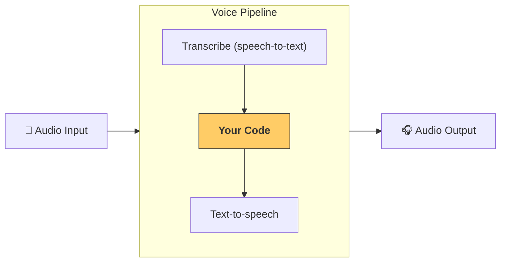

---
search:
  exclude: true
---
# パイプラインとワークフロー

[`VoicePipeline`][agents.voice.pipeline.VoicePipeline] は、エージェント型ワークフローを音声アプリに簡単に変換できるクラスです。実行するワークフローを渡すと、パイプラインが入力音声の文字起こし、音声終了の検出、適切なタイミングでのワークフローの呼び出し、ワークフロー出力の音声への変換を行います。



## パイプラインの設定

パイプラインを作成するとき、次の項目を設定できます。

1. [`workflow`][agents.voice.workflow.VoiceWorkflowBase]。新しい音声が文字起こしされるたびに実行されるコードです。
2. 使用する [`speech-to-text`][agents.voice.model.STTModel] モデルと [`text-to-speech`][agents.voice.model.TTSModel] モデル
3. [`config`][agents.voice.pipeline_config.VoicePipelineConfig]。次のような項目を設定できます。
    - モデル名をモデルにマッピングできるモデルプロバイダー
    - トレーシングを無効にするかどうか、音声ファイルをアップロードするかどうか、ワークフロー名、トレース ID などのトレーシング設定
    - プロンプト、言語、使用するデータ型など、TTS モデルと STT モデルの設定

## パイプラインの実行

[`run()`][agents.voice.pipeline.VoicePipeline.run] メソッドを使用してパイプラインを実行できます。このメソッドには、次の 2 つの形式で音声入力を渡せます。

1. [`AudioInput`][agents.voice.input.AudioInput] は、完全な音声入力があり、その結果を生成するだけの場合に使用します。これは、話者が話し終えたタイミングを検出する必要がない場合に便利です。たとえば、事前に録音された音声がある場合や、ユーザーが話し終えたタイミングが明確なプッシュ・トゥ・トークアプリの場合です。
2. [`StreamedAudioInput`][agents.voice.input.StreamedAudioInput] は、ユーザーが話し終えたタイミングを検出する必要がある場合に使用します。検出された音声チャンクを順次プッシュでき、音声パイプラインは「アクティビティ検出」と呼ばれる処理を通じて、適切なタイミングでエージェントのワークフローを自動的に実行します。

## 結果

音声パイプラインの実行結果は [`StreamedAudioResult`][agents.voice.result.StreamedAudioResult] です。これは、イベントの発生に応じてストリーミングできるオブジェクトです。[`VoiceStreamEvent`][agents.voice.events.VoiceStreamEvent] には、次のようないくつかの種類があります。

1. [`VoiceStreamEventAudio`][agents.voice.events.VoiceStreamEventAudio]。音声チャンクを含みます。
2. [`VoiceStreamEventLifecycle`][agents.voice.events.VoiceStreamEventLifecycle]。ターンの開始や終了などのライフサイクルイベントを通知します。
3. [`VoiceStreamEventError`][agents.voice.events.VoiceStreamEventError]。エラーイベントです。

アプリケーションが [`StreamedAudioResult.stream()`][agents.voice.result.StreamedAudioResult.stream] を処理している間に、パイプラインの終端エラーが送出されます。それ以外は正常に実行されたにもかかわらず、音声テキスト変換の文字起こしセッションを閉じられなかった場合、ストリームは無期限に待機する代わりに、そのクローズエラーを送出します。ターンがすでに失敗しており、文字起こしセッションのクローズも失敗した場合、ストリームは元のターンエラーを主要なエラーとして保持します。

```python

result = await pipeline.run(input)

async for event in result.stream():
    if event.type == "voice_stream_event_audio":
        # play audio
        pass
    elif event.type == "voice_stream_event_lifecycle":
        # lifecycle
        pass
    elif event.type == "voice_stream_event_error":
        # error
        pass
```

## ベストプラクティス

### 割り込み

現在、Agents SDK は [`StreamedAudioInput`][agents.voice.input.StreamedAudioInput] に対する組み込みの割り込み処理を提供していません。代わりに、検出されたターンごとにワークフローが個別に実行されます。アプリケーション内で割り込みを処理する場合は、[`VoiceStreamEventLifecycle`][agents.voice.events.VoiceStreamEventLifecycle] イベントをリッスンできます。`turn_started` は、新しいターンが文字起こしされ、処理が開始されたことを示します。`turn_ended` は、該当するターンのすべての音声が送信された後にトリガーされます。これらのイベントを使用して、モデルがターンを開始したときに話者のマイクをミュートし、アプリケーションがそのターンに関連するすべての音声の再生を終えた後にミュートを解除できます。