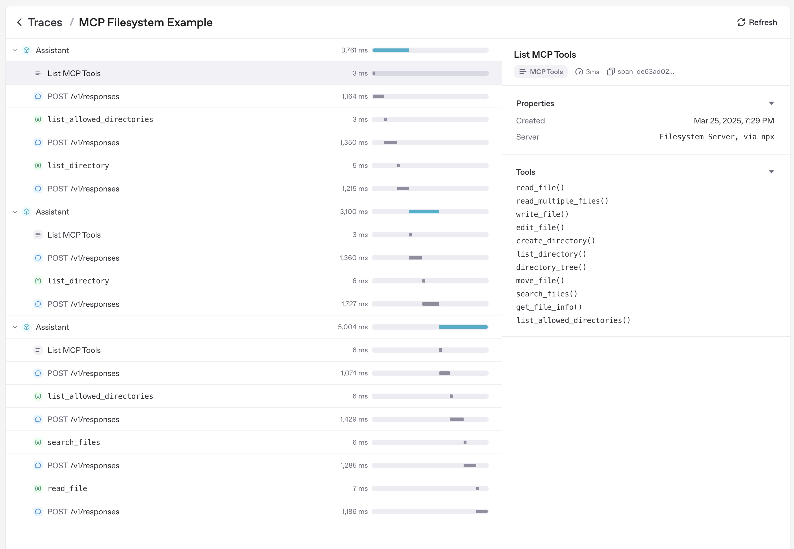

---
search:
  exclude: true
---
# Model context protocol (MCP)

[Model context protocol](https://modelcontextprotocol.io/introduction)(MCP)은 애플리케이션이 언어 모델에 도구와
컨텍스트를 노출하는 방식을 표준화합니다. 공식 문서에서는 다음과 같이 설명합니다.

> MCP는 애플리케이션이 LLM에 컨텍스트를 제공하는 방식을 표준화하는 개방형 프로토콜입니다. MCP를 AI
> 애플리케이션용 USB-C 포트라고 생각해 보세요. USB-C가 기기를 다양한 주변 장치와 액세서리에 연결하는 표준화된 방식을 제공하듯이, MCP는
> AI 모델을 다양한 데이터 소스 및 도구에 연결하는 표준화된 방식을 제공합니다.

Agents Python SDK는 여러 MCP 전송 방식을 지원합니다. 따라서 기존 MCP 서버를 재사용하거나 자체 서버를 구축하여 파일 시스템, HTTP 또는 커넥터 기반 도구를 에이전트에 노출할 수 있습니다.

!!! warning "연결 전 MCP 서버 신뢰성 확인"

    MCP 도구는 모델 컨텍스트의 데이터를 노출하고 제공된 자격 증명으로 작업을 수행할 수 있습니다. 신뢰할 수 있는 서버에만 연결하고, 최소 권한 자격 증명을 사용하며, 액세스 토큰을 URL이 아닌 인증 필드나 헤더에 보관하고, 민감한 작업에는 승인을 요구해야 합니다. [OpenAI MCP 보안 지침](https://developers.openai.com/api/docs/guides/tools-connectors-mcp#risks-and-safety)을 참고하세요.

## MCP 통합 선택

MCP 서버를 에이전트에 연결하기 전에 도구 호출을 실행할 위치와 접근 가능한 전송 방식을 결정해야 합니다. 아래 표는 Python SDK가 지원하는 옵션을 요약합니다.

| 필요한 사항                                                                        | 권장 옵션                                    |
| ------------------------------------------------------------------------------------ | ----------------------------------------------------- |
| OpenAI의 Responses API가 모델을 대신하여 공개적으로 접근 가능한 MCP 서버를 호출하도록 구성| [`HostedMCPTool`][agents.tool.HostedMCPTool]을 통한 **호스티드 MCP 서버 도구** |
| 로컬 또는 원격에서 실행하는 Streamable HTTP 서버에 연결                  | [`MCPServerStreamableHttp`][agents.mcp.server.MCPServerStreamableHttp]을 통한 **Streamable HTTP MCP 서버** |
| Server-Sent Events를 사용하는 HTTP를 구현한 서버와 통신                          | [`MCPServerSse`][agents.mcp.server.MCPServerSse]를 통한 **SSE 기반 HTTP MCP 서버** |
| 로컬 프로세스를 실행하고 stdin/stdout을 통해 통신                             | [`MCPServerStdio`][agents.mcp.server.MCPServerStdio]을 통한 **stdio MCP 서버** |

아래 섹션에서는 각 옵션의 구성 방법과 특정 전송 방식을 다른 방식보다 우선해야 하는 경우를 설명합니다.

## MCP Python SDK v1 및 v2

Agents SDK는 `mcp>=1.19.0,<3` 종속성 범위를 통해 `mcp` Python 패키지의 두 주요 버전을 모두 지원합니다. 설치된 `mcp` 패키지 버전은 서버와 협상하는 MCP 프로토콜 버전과 별개입니다. Agents SDK는 설치된 패키지의 메이저 버전을 감지하고 stdio, SSE, Streamable HTTP 연결을 자동으로 조정하므로 일반적인 서버 구성에는 버전 전환 설정이 필요하지 않습니다.

MCP Python SDK v2가 설치되어 있으면 Agents SDK는 구성된 로컬 전송 방식에 `mode="auto"`을 적용하여 v2 `mcp.Client`을 생성합니다. 클라이언트는 먼저 설치된 MCP SDK가 지원하는 최신 프로토콜 버전으로 `server/discover` 프로브를 전송합니다. 최신 서버는 프로브에 응답하고 클라이언트는 그 결과를 채택합니다. 이전 서버가 `server/discover`을 지원하지 않으면 클라이언트는 레거시 `initialize` 핸드셰이크로 폴백하고 여기에서 협상된 프로토콜 버전을 사용합니다. 따라서 MCP Python SDK v2를 설치해도 모든 연결에서 최신 MCP 프로토콜 버전을 사용하도록 강제되지는 않습니다. MCP Python SDK의 [프로토콜 버전 협상 가이드](https://py.sdk.modelcontextprotocol.io/protocol-versions/)를 참고하세요.

대부분의 애플리케이션에서는 종속성 리졸버가 호환되는 버전을 선택하도록 해야 합니다. 애플리케이션이 특정 메이저 버전을 유지해야 한다면 `openai-agents`과 함께 명시적 제약 조건을 추가하세요.

```bash
# MCP Python SDK v1
pip install "mcp>=1.19.0,<2"

# MCP Python SDK v2
pip install "mcp>=2,<3"
```

HTTP 전송 방식의 사용자 정의에는 설치된 MCP 패키지가 소유한 HTTP 스택을 사용해야 합니다.

| 사용자 정의 | MCP Python SDK v1 | MCP Python SDK v2 |
| --- | --- | --- |
| `params["auth"]` | `httpx.Auth` | `httpx2.Auth` |
| `params["httpx_client_factory"]` 반환 값 | `httpx.AsyncClient` | `httpx2.AsyncClient` |
| `MCPServerStreamableHttp` `params["ignore_initialized_notification_failure"] = True` | 지원됨 | 지원되지 않음. 연결 전에 거부됨 |

가능하면 아래 Streamable HTTP 예제와 같이 `Authorization` 헤더를 사용하세요. `Authorization` 헤더는 두 패키지 버전 모두에서 변경 없이 작동합니다. 애플리케이션이 `params["auth"]` 또는 `params["httpx_client_factory"]`을 제공하는 경우 해당 값은 설치된 `mcp` 패키지의 메이저 버전에 맞는 HTTP 타입을 사용해야 합니다. 애플리케이션이 `MCPServerStreamableHttp`의 `params["ignore_initialized_notification_failure"] = True`을 설정하는 경우 업그레이드하기 전에 `mcp<2`을 유지하거나 해당 옵션을 비활성화해야 합니다.

이러한 로컬 `mcp` 종속성 요구 사항은 원격 MCP 연결을 OpenAI Responses API가 관리하는 [`HostedMCPTool`][agents.tool.HostedMCPTool]에는 적용되지 않습니다.

## 에이전트 수준 MCP 구성

전송 방식을 선택하는 것 외에도 `Agent.mcp_config`을 설정하여 MCP 도구의 준비 방식을 조정할 수 있습니다.

```python
from agents import Agent

agent = Agent(
    name="Assistant",
    mcp_servers=[server],
    mcp_config={
        # Try to convert MCP tool schemas to strict JSON schema.
        "convert_schemas_to_strict": True,
        # If None, MCP tool failures are raised as exceptions instead of
        # returning model-visible error text.
        "failure_error_function": None,
        # Prefix local MCP tool names with their server name.
        "include_server_in_tool_names": True,
    },
)
```

참고:

- `convert_schemas_to_strict`은 최선형 방식으로 작동합니다. 스키마를 변환할 수 없으면 원래 스키마를 사용합니다.
- `failure_error_function`은 MCP 도구 호출 실패가 모델에 표시되는 방식을 제어합니다.
- `failure_error_function`이 설정되지 않으면 SDK는 기본 도구 오류 포매터를 사용합니다.
- 서버 수준의 `failure_error_function`은 해당 서버에 대해 `Agent.mcp_config["failure_error_function"]`을 재정의합니다.
- `include_server_in_tool_names`은 선택적으로 활성화해야 합니다. 활성화하면 각 로컬 MCP 도구가 결정론적으로 생성된 서버 접두사 이름으로 모델에 노출되므로 여러 MCP 서버가 같은 이름의 도구를 게시할 때 충돌을 방지하는 데 도움이 됩니다. 생성된 이름은 ASCII에 안전하고 `FunctionTool` 인스턴스의 이름 길이 제한을 준수하며, 같은 에이전트에 구성된 로컬 `FunctionTool` 인스턴스의 이름이나 활성화된 핸드오프와 충돌하지 않습니다. SDK는 계속해서 원래 서버에서 원래 MCP 도구 이름을 호출합니다.

## 전송 방식 공통 패턴

전송 방식을 선택한 후에는 대부분의 통합에서 다음과 같은 결정을 내려야 합니다.

- 도구 일부만 노출하는 방법([도구 필터링](#tool-filtering))
- 서버가 재사용 가능한 프롬프트도 제공하는지 여부([프롬프트](#prompts))
- `list_tools()`의 캐싱 여부([캐싱](#caching))
- 트레이스에서 MCP 활동이 표시되는 방식([트레이싱](#tracing))

로컬 MCP 서버(`MCPServerStdio`, `MCPServerSse`, `MCPServerStreamableHttp`)에서는 승인 정책과 호출별 `_meta` 페이로드도 공통 개념입니다. Streamable HTTP 섹션에서 가장 완전한 예제를 제공하며, 동일한 패턴이 다른 로컬 전송 방식에도 적용됩니다.

## 1. 호스티드 MCP 서버 도구

호스티드 툴은 전체 도구 왕복 과정을 OpenAI 인프라에서 처리합니다. 코드에서 도구 목록을 조회하고 호출하는 대신 [`HostedMCPTool`][agents.tool.HostedMCPTool]이 서버 레이블과 선택적 커넥터 메타데이터를 Responses API에 전달합니다. 모델은 Python 프로세스에 추가 콜백을 보내지 않고 원격 서버의 도구 목록을 조회하고 호출합니다. 현재 호스티드 툴은 Responses API의 호스티드 MCP 통합을 지원하는 OpenAI 모델에서 작동합니다.

### 기본 호스티드 MCP 도구

에이전트의 `tools` 목록에 [`HostedMCPTool`][agents.tool.HostedMCPTool]을 추가하여 호스티드 툴을 생성합니다. `tool_config`
딕셔너리는 REST API로 전송할 JSON과 동일한 구조를 사용합니다.

```python
import asyncio

from agents import Agent, HostedMCPTool, Runner

async def main() -> None:
    agent = Agent(
        name="Assistant",
        instructions="Use the DeepWiki hosted MCP server to inspect openai/openai-agents-python.",
        tools=[
            HostedMCPTool(
                tool_config={
                    "type": "mcp",
                    "server_label": "deepwiki",
                    "server_url": "https://mcp.deepwiki.com/mcp",
                    "require_approval": "never",
                }
            )
        ],
    )

    result = await Runner.run(
        agent,
        "Which language is the repository openai/openai-agents-python written in?",
    )
    print(result.final_output)

asyncio.run(main())
```

호스티드 서버는 도구를 자동으로 노출하므로 `mcp_servers`에 추가하지 않습니다.

호스티드 도구 검색에서 호스티드 MCP 서버를 지연 로드하려면 `tool_config["defer_loading"] = True`을 설정하고 [`ToolSearchTool`][agents.tool.ToolSearchTool]을 에이전트에 추가하세요. 이 기능은 OpenAI Responses 모델에서만 지원됩니다. 전체 도구 검색 구성과 제약 조건은 [도구](tools.md#hosted-tool-search)를 참고하세요.

### 호스티드 MCP 결과 스트리밍

호스티드 툴은 함수 도구와 정확히 같은 방식으로 결과 스트리밍을 지원합니다. 모델이 계속 작업하는 동안
증분 MCP 출력을 사용하려면 `Runner.run_streamed`을 사용하세요.

```python
result = Runner.run_streamed(agent, "Summarise this repository's top languages")
async for event in result.stream_events():
    if event.type == "run_item_stream_event":
        print(f"Received: {event.item}")
print(result.final_output)
```

### 선택적 승인 흐름

서버가 민감한 작업을 수행할 수 있다면 각 도구를 실행하기 전에 사람 또는 프로그램의 승인을 요구할 수 있습니다. `tool_config`의 `require_approval`을 단일 정책(`"always"`, `"never"`) 또는 도구 이름을 정책에 매핑하는 딕셔너리로 구성하세요. Python에서 결정을 내리려면 `on_approval_request` 콜백을 제공하세요.

```python
from agents import MCPToolApprovalFunctionResult, MCPToolApprovalRequest

SAFE_TOOLS = {"read_wiki_structure", "read_wiki_contents", "ask_question"}

def approve_tool(request: MCPToolApprovalRequest) -> MCPToolApprovalFunctionResult:
    if request.data.name in SAFE_TOOLS:
        return {"approve": True}
    return {"approve": False, "reason": "Escalate to a human reviewer"}

agent = Agent(
    name="Assistant",
    tools=[
        HostedMCPTool(
            tool_config={
                "type": "mcp",
                "server_label": "deepwiki",
                "server_url": "https://mcp.deepwiki.com/mcp",
                "require_approval": "always",
            },
            on_approval_request=approve_tool,
        )
    ],
)
```

콜백은 동기식 또는 비동기식일 수 있으며, 모델이 실행을 계속하기 위해 승인 데이터가 필요할 때마다 호출됩니다.

### 커넥터 기반 호스티드 서버

호스티드 MCP는 OpenAI 커넥터도 지원합니다. `server_url`을 지정하는 대신 `connector_id`와 액세스 토큰을 제공하세요. Responses API가 인증을 처리하고 호스티드 서버가 커넥터의 도구를 노출합니다.

```python
import os

HostedMCPTool(
    tool_config={
        "type": "mcp",
        "server_label": "google_calendar",
        "connector_id": "connector_googlecalendar",
        "authorization": os.environ["GOOGLE_CALENDAR_AUTHORIZATION"],
        "require_approval": "never",
    }
)
```

스트리밍, 승인, 커넥터를 포함하여 완전히 작동하는 호스티드 툴 샘플은 [`examples/hosted_mcp`](https://github.com/openai/openai-agents-python/tree/main/examples/hosted_mcp)에서 확인할 수 있습니다.

## 2. Streamable HTTP MCP 서버

네트워크 연결을 직접 관리하려면 [`MCPServerStreamableHttp`][agents.mcp.server.MCPServerStreamableHttp]을 사용하세요. Streamable HTTP 서버는 전송 방식을 직접 제어하거나, 짧은 지연 시간을 유지하면서 자체 인프라 내에서 서버를 실행하려는 경우에 적합합니다.

```python
import asyncio
import os

from agents import Agent, Runner
from agents.mcp import MCPServerStreamableHttp
from agents.model_settings import ModelSettings

async def main() -> None:
    token = os.environ["MCP_SERVER_TOKEN"]
    async with MCPServerStreamableHttp(
        name="Streamable HTTP Python Server",
        params={
            "url": "http://localhost:8000/mcp",
            "headers": {"Authorization": f"Bearer {token}"},
            "timeout": 10,
        },
        cache_tools_list=True,
        max_retry_attempts=3,
    ) as server:
        agent = Agent(
            name="Assistant",
            instructions="Use the MCP tools to answer the questions.",
            mcp_servers=[server],
            model_settings=ModelSettings(tool_choice="required"),
        )

        result = await Runner.run(agent, "Add 7 and 22.")
        print(result.final_output)

asyncio.run(main())
```

생성자는 다음과 같은 추가 옵션을 지원합니다.

- `client_session_timeout_seconds`은 MCP ClientSession 읽기 타임아웃을 제어합니다. `datetime.timedelta`으로 표현할 수 있고 최소 1마이크로초인 양의 유한 값은 유한 타임아웃을 설정하며, `None`과 `0`은 타임아웃을 비활성화합니다. 그 밖의 값은 서버 생성 시 거부됩니다.
- `use_structured_content`은 텍스트 출력보다 `tool_result.structured_content`을 우선할지 여부를 전환합니다.
- `max_retry_attempts`과 `retry_backoff_seconds_base`은 `list_tools()` 및 `call_tool()`에 자동 재시도를 추가합니다.
- `tool_filter`을 사용하면 도구 일부만 노출할 수 있습니다([도구 필터링](#tool-filtering) 참고).
- `require_approval`은 로컬 MCP 도구에 휴먼인더루프 (HITL) 승인 정책을 활성화합니다.
- `failure_error_function`은 모델에 표시되는 MCP 도구 실패 메시지를 사용자 정의합니다. 대신 오류를 발생시키려면 `None`로 설정하세요.
- `tool_meta_resolver`은 `call_tool()` 전에 호출별 MCP `_meta` 페이로드를 삽입합니다.

### 로컬 MCP 서버의 승인 정책

`MCPServerStdio`, `MCPServerSse`, `MCPServerStreamableHttp`은 모두 `require_approval`을 지원합니다.

지원되는 형식:

- 모든 도구에 적용되는 `"always"` 또는 `"never"`
- `True`은 모든 도구에 승인을 요구하고, `False`은 어떤 도구에도 승인을 요구하지 않음(각각 `"always"` 및 `"never"`과 동일)
- 도구별 맵(예: `{"delete_file": "always", "read_file": "never"}`)
- 그룹화된 객체: `{"always": {"tool_names": [...]}, "never": {"tool_names": [...]}}`

```python
async with MCPServerStreamableHttp(
    name="Filesystem MCP",
    params={"url": "http://localhost:8000/mcp"},
    require_approval={"always": {"tool_names": ["delete_file"]}},
) as server:
    ...
```

전체 일시 중지/재개 흐름은 [휴먼인더루프](human_in_the_loop.md)와 `examples/mcp/get_all_mcp_tools_example/main.py`을 참고하세요.

### `tool_meta_resolver`을 사용한 호출별 메타데이터

MCP 서버가 `_meta`에서 요청 메타데이터(예: 테넌트 ID 또는 트레이스 컨텍스트)를 기대하는 경우 `tool_meta_resolver`을 사용하세요. 아래 예제에서는 `dict`을 `Runner.run(...)`의 `context`으로 전달한다고 가정합니다.

```python
from agents.mcp import MCPServerStreamableHttp, MCPToolMetaContext


def resolve_meta(context: MCPToolMetaContext) -> dict[str, str] | None:
    run_context_data = context.run_context.context or {}
    tenant_id = run_context_data.get("tenant_id")
    if tenant_id is None:
        return None
    return {"tenant_id": str(tenant_id), "source": "agents-sdk"}


server = MCPServerStreamableHttp(
    name="Metadata-aware MCP",
    params={"url": "http://localhost:8000/mcp"},
    tool_meta_resolver=resolve_meta,
)
```

실행 컨텍스트가 Pydantic 모델, 데이터 클래스 또는 사용자 정의 클래스라면 속성 접근 방식으로 테넌트 ID를 읽으세요.

### MCP 도구 출력: 텍스트, 이미지 및 기타 콘텐츠

MCP 결과가 콘텐츠 블록을 사용하면 SDK는 텍스트 콘텐츠를 텍스트 출력으로 전달하고 이미지 콘텐츠를 도구 출력의 이미지 타입 항목으로 매핑합니다. 오디오 및 리소스 블록을 비롯한 다른 MCP 콘텐츠 블록 타입의 경우 SDK는 해당 블록을 유효한 JSON으로 직렬화한 값을 텍스트 출력으로 전달합니다. 여러 콘텐츠 블록이 포함된 응답은 출력 항목 목록으로 전달됩니다. `use_structured_content=True`이 비어 있지 않고 오류가 없는 `structuredContent` 페이로드를 선택하면 해당 structured payload가 이러한 콘텐츠 블록보다 우선합니다. structured content가 누락되었거나 비어 있으면 콘텐츠 블록으로 폴백합니다.

## 3. SSE 기반 HTTP MCP 서버

!!! warning

    MCP 프로젝트는 Server-Sent Events 전송 방식을 더 이상 권장하지 않습니다. 새로운 통합에는 Streamable HTTP 또는 stdio를 우선하고, SSE는 레거시 서버에만 사용하세요.

MCP 서버가 SSE 기반 HTTP 전송 방식을 구현하는 경우 [`MCPServerSse`][agents.mcp.server.MCPServerSse]을 인스턴스화하세요. 전송 방식을 제외하면 API는 Streamable HTTP 서버와 동일합니다.

```python

from agents import Agent, Runner
from agents.model_settings import ModelSettings
from agents.mcp import MCPServerSse

workspace_id = "demo-workspace"

async with MCPServerSse(
    name="SSE Python Server",
    params={
        "url": "http://localhost:8000/sse",
        "headers": {"X-Workspace": workspace_id},
    },
    cache_tools_list=True,
) as server:
    agent = Agent(
        name="Assistant",
        mcp_servers=[server],
        model_settings=ModelSettings(tool_choice="required"),
    )
    result = await Runner.run(agent, "What's the weather in Tokyo?")
    print(result.final_output)
```

## 4. stdio MCP 서버

로컬 하위 프로세스로 실행되는 MCP 서버에는 [`MCPServerStdio`][agents.mcp.server.MCPServerStdio]을 사용하세요. SDK는 프로세스를 생성하고 파이프를 열린 상태로 유지하며 컨텍스트 관리자가 종료될 때 자동으로 닫습니다. 이 옵션은 빠르게 개념 증명을 만들거나 서버가 명령줄 진입점만 노출하는 경우에 유용합니다.

```python
from pathlib import Path
from agents import Agent, Runner
from agents.mcp import MCPServerStdio

current_dir = Path(__file__).parent
samples_dir = current_dir / "sample_files"

async with MCPServerStdio(
    name="Filesystem Server via npx",
    params={
        "command": "npx",
        "args": ["-y", "@modelcontextprotocol/server-filesystem", str(samples_dir)],
    },
) as server:
    agent = Agent(
        name="Assistant",
        instructions="Use the files in the sample directory to answer questions.",
        mcp_servers=[server],
    )
    result = await Runner.run(agent, "List the files available to you.")
    print(result.final_output)
```

## 5. MCP 서버 관리자

MCP 서버가 여러 개라면 `MCPServerManager`을 사용하여 미리 연결하고, 연결에 성공한 서버만 에이전트에 노출하세요. 생성자 옵션과 재연결 동작은 [MCPServerManager API 레퍼런스](ref/mcp/manager.md)를 참고하세요.

```python
from agents import Agent, Runner
from agents.mcp import MCPServerManager, MCPServerStreamableHttp

servers = [
    MCPServerStreamableHttp(name="calendar", params={"url": "http://localhost:8000/mcp"}),
    MCPServerStreamableHttp(name="docs", params={"url": "http://localhost:8001/mcp"}),
]

async with MCPServerManager(servers) as manager:
    agent = Agent(
        name="Assistant",
        instructions="Use MCP tools when they help.",
        mcp_servers=manager.active_servers,
    )
    result = await Runner.run(agent, "Which MCP tools are available?")
    print(result.final_output)
```

주요 동작:

- `drop_failed_servers=True`일 때(기본값) `active_servers`에는 연결에 성공한 서버만 포함됩니다.
- 실패는 `failed_servers` 및 `errors`에서 추적됩니다.
- 첫 번째 연결 실패 시 오류를 발생시키려면 `strict=True`을 설정하세요.
- 실패한 서버를 다시 시도하려면 `reconnect(failed_only=True)`을 호출하고, 모든 서버를 재시작하려면 `reconnect(failed_only=False)`을 호출하세요.
- `connect_all()`, `reconnect()`, `cleanup_all()` 호출은 직렬화됩니다. 수명 주기 작업이 이미 실행 중이라면 다른 수명 주기 작업은 같은 서버에 동시에 연결하거나 정리하지 않고 기존 작업이 끝날 때까지 기다립니다.
- 수명 주기 동작을 조정하려면 `connect_timeout_seconds`, `cleanup_timeout_seconds`, `connect_in_parallel`을 설정하세요. 두 수명 주기 타임아웃의 기본값은 10초입니다. 양의 유한한 초 단위 값 또는 비활성화를 위한 `None`을 지원하며, 생성 시와 할당 시 모두 검증됩니다. 0은 즉시 기한 만료를 발생시키므로 거부됩니다.

## 공통 서버 기능

아래 섹션은 MCP 서버 전송 방식 전반에 적용됩니다. 정확한 API 인터페이스는 서버 클래스에 따라 달라집니다.

## 도구 필터링

각 MCP 서버는 에이전트에 필요한 함수만 노출할 수 있도록 도구 필터를 지원합니다. 필터링은 생성 시점에 수행하거나 실행별로 동적으로 수행할 수 있습니다.

### 정적 도구 필터링

간단한 허용/차단 목록을 구성하려면 [`create_static_tool_filter`][agents.mcp.create_static_tool_filter]을 사용하세요.

```python
from pathlib import Path

from agents.mcp import MCPServerStdio, create_static_tool_filter

samples_dir = Path("/path/to/files")

filesystem_server = MCPServerStdio(
    params={
        "command": "npx",
        "args": ["-y", "@modelcontextprotocol/server-filesystem", str(samples_dir)],
    },
    tool_filter=create_static_tool_filter(allowed_tool_names=["read_file", "write_file"]),
)
```

`allowed_tool_names`과 `blocked_tool_names`이 모두 제공되면 SDK는 먼저 허용 목록을 적용한 후 남은 집합에서 차단된 도구를 제거합니다.

### 동적 도구 필터링

더 정교한 로직을 구현하려면 [`ToolFilterContext`][agents.mcp.ToolFilterContext]을 받는 호출 가능 객체를 전달하세요. 호출 가능 객체는 동기식 또는 비동기식일 수 있으며, 도구를 노출해야 하는 경우 `True`을 반환합니다.

```python
from pathlib import Path

from agents.mcp import MCPServerStdio, ToolFilterContext

samples_dir = Path("/path/to/files")

async def context_aware_filter(context: ToolFilterContext, tool) -> bool:
    if context.agent.name == "Code Reviewer" and tool.name.startswith("danger_"):
        return False
    return True

async with MCPServerStdio(
    params={
        "command": "npx",
        "args": ["-y", "@modelcontextprotocol/server-filesystem", str(samples_dir)],
    },
    tool_filter=context_aware_filter,
) as server:
    ...
```

필터 컨텍스트는 활성 `run_context`, 도구를 요청하는 `agent`, `server_name`을 노출합니다.

## 프롬프트

MCP 서버는 에이전트 지침을 동적으로 생성하는 프롬프트도 제공할 수 있습니다. 프롬프트를 지원하는 서버는 다음 두
메서드를 노출합니다.

- `list_prompts()`은 사용 가능한 프롬프트 템플릿을 열거합니다.
- `get_prompt(name, arguments)`은 선택적으로 매개변수와 함께 구체적인 프롬프트를 가져옵니다.

```python
from agents import Agent

prompt_result = await server.get_prompt(
    "generate_code_review_instructions",
    {"focus": "security vulnerabilities", "language": "python"},
)
instructions = prompt_result.messages[0].content.text

agent = Agent(
    name="Code Reviewer",
    instructions=instructions,
    mcp_servers=[server],
)
```

## 페이지네이션

기본 제공 로컬 MCP 서버 클래스는 도구와 프롬프트 목록을 조회할 때 `nextCursor`을 자동으로 따릅니다. `list_tools()`은 필터를 적용하거나 캐시를 채우기 전에 전체 도구 목록을 수집하고, `list_prompts()`은 `nextCursor=None`과 함께 하나로 결합된 결과를 반환합니다. 이후 페이지에서 오류가 발생하거나 서버가 커서를 반복하면 일부 결과를 노출하거나 캐싱하는 대신 작업에서 오류가 발생합니다.

리소스는 명시적 페이지네이션을 계속 사용합니다. 다음 페이지를 가져오려면 `list_resources()` 또는 `list_resource_templates()`에서 반환된 `nextCursor`을 `cursor` 인수로 다시 전달하세요.

## 캐싱

각 에이전트 실행은 모든 MCP 서버에서 `list_tools()`을 호출합니다. 원격 서버는 상당한 지연 시간을 유발할 수 있으므로 모든 MCP 서버 클래스는 `cache_tools_list` 옵션을 제공합니다. 도구 정의가 자주 변경되지 않는다고 확신하는 경우에만 `True`로 설정하세요. 나중에 목록을 새로 가져오려면 서버 인스턴스에서 `invalidate_tools_cache()`을 호출하세요.

## 트레이싱

[트레이싱](./tracing.md)은 다음을 포함한 MCP 활동을 자동으로 캡처합니다.

1. 도구 목록을 조회하기 위한 MCP 서버 호출
2. 도구 호출의 MCP 관련 정보



## 추가 자료

- [Model Context Protocol](https://modelcontextprotocol.io/) – 사양 및 설계 가이드
- [examples/mcp](https://github.com/openai/openai-agents-python/tree/main/examples/mcp) – 실행 가능한 stdio, SSE, Streamable HTTP 샘플
- [examples/hosted_mcp](https://github.com/openai/openai-agents-python/tree/main/examples/hosted_mcp) – 승인과 커넥터를 포함한 전체 호스티드 MCP 데모