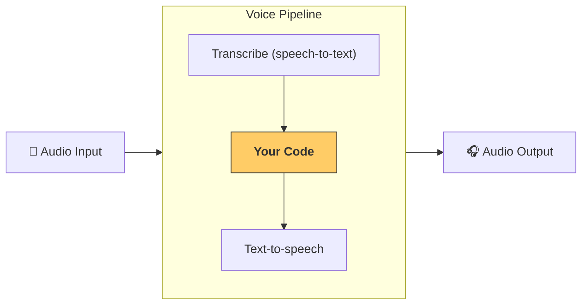

---
search:
  exclude: true
---
# 파이프라인 및 워크플로

[`VoicePipeline`][agents.voice.pipeline.VoicePipeline]는 에이전트 워크플로를 음성 앱으로 쉽게 전환할 수 있게 해 주는 클래스입니다. 실행할 워크플로를 전달하면 파이프라인이 입력 오디오 변환, 오디오 종료 감지, 적절한 시점의 워크플로 호출, 워크플로 출력의 오디오 변환을 처리합니다.



## 파이프라인 구성

파이프라인을 생성할 때 다음과 같은 몇 가지 항목을 설정할 수 있습니다.

1. 새 오디오가 텍스트로 변환될 때마다 실행되는 코드인 [`workflow`][agents.voice.workflow.VoiceWorkflowBase]
2. 사용할 [`speech-to-text`][agents.voice.model.STTModel] 및 [`text-to-speech`][agents.voice.model.TTSModel] 모델
3. 다음과 같은 항목을 구성할 수 있는 [`config`][agents.voice.pipeline_config.VoicePipelineConfig]
    - 모델 이름을 모델에 매핑할 수 있는 모델 공급자
    - 트레이싱 비활성화 여부, 오디오 파일 업로드 여부, 워크플로 이름, trace ID 등을 포함한 트레이싱 설정
    - 프롬프트, 언어, 사용되는 데이터 유형과 같은 TTS 및 STT 모델 설정

## 파이프라인 실행

[`run()`][agents.voice.pipeline.VoicePipeline.run] 메서드를 통해 파이프라인을 실행할 수 있으며, 다음 두 가지 형태로 오디오 입력을 전달할 수 있습니다.

1. [`AudioInput`][agents.voice.input.AudioInput]은 완전한 오디오 입력이 있고 이에 대한 결과만 생성하려는 경우에 사용합니다. 화자가 말을 마쳤는지 감지할 필요가 없는 경우에 유용합니다. 예를 들어 사전 녹음된 오디오가 있거나 사용자가 말을 마친 시점을 명확히 알 수 있는 눌러서 말하기(push-to-talk) 앱에서 사용할 수 있습니다.
2. [`StreamedAudioInput`][agents.voice.input.StreamedAudioInput]은 사용자가 말을 마쳤는지 감지해야 할 수 있는 경우에 사용합니다. 오디오 청크가 감지되는 대로 전달할 수 있으며, 음성 파이프라인은 "활동 감지(activity detection)"라는 프로세스를 통해 적절한 시점에 에이전트 워크플로를 자동으로 실행합니다.

## 결과

음성 파이프라인 실행의 결과는 [`StreamedAudioResult`][agents.voice.result.StreamedAudioResult]입니다. 이 객체를 사용하면 이벤트가 발생하는 대로 스트리밍할 수 있습니다. [`VoiceStreamEvent`][agents.voice.events.VoiceStreamEvent]에는 다음과 같은 몇 가지 유형이 있습니다.

1. 오디오 청크를 포함하는 [`VoiceStreamEventAudio`][agents.voice.events.VoiceStreamEventAudio]
2. 턴 시작 또는 종료와 같은 수명 주기 이벤트를 알려 주는 [`VoiceStreamEventLifecycle`][agents.voice.events.VoiceStreamEventLifecycle]
3. 오류 이벤트인 [`VoiceStreamEventError`][agents.voice.events.VoiceStreamEventError]

애플리케이션이 [`StreamedAudioResult.stream()`][agents.voice.result.StreamedAudioResult.stream]을 사용하는 동안 치명적인 파이프라인 오류가 발생합니다. 그 외에는 정상적으로 실행되었지만 음성-텍스트 변환 세션을 종료하지 못한 경우, 스트림은 무기한 기다리지 않고 해당 종료 오류를 발생시킵니다. 턴이 이미 실패한 상태에서 음성 변환 세션 종료까지 실패한 경우, 스트림은 원래 턴 오류를 기본 오류로 유지합니다.

```python

result = await pipeline.run(input)

async for event in result.stream():
    if event.type == "voice_stream_event_audio":
        # play audio
        pass
    elif event.type == "voice_stream_event_lifecycle":
        # lifecycle
        pass
    elif event.type == "voice_stream_event_error":
        # error
        pass
```

## 모범 사례

### 인터럽션(중단 처리)

현재 Agents SDK는 [`StreamedAudioInput`][agents.voice.input.StreamedAudioInput]에 내장된 인터럽션(중단 처리) 기능을 제공하지 않습니다. 대신 감지된 각 턴이 워크플로의 개별 실행을 트리거합니다. 애플리케이션 내에서 인터럽션(중단 처리)을 처리하려면 [`VoiceStreamEventLifecycle`][agents.voice.events.VoiceStreamEventLifecycle] 이벤트를 수신할 수 있습니다. `turn_started`은 새 턴이 텍스트로 변환되어 처리가 시작되고 있음을 나타냅니다. `turn_ended`은 해당 턴의 모든 오디오가 전송된 후 트리거됩니다. 이러한 이벤트를 사용하여 모델이 턴을 시작할 때 화자의 마이크를 음소거하고, 애플리케이션이 해당 턴과 관련된 모든 오디오 재생을 마친 후 음소거를 해제할 수 있습니다.