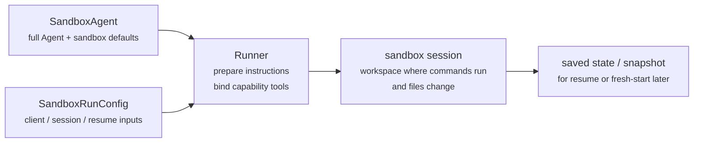
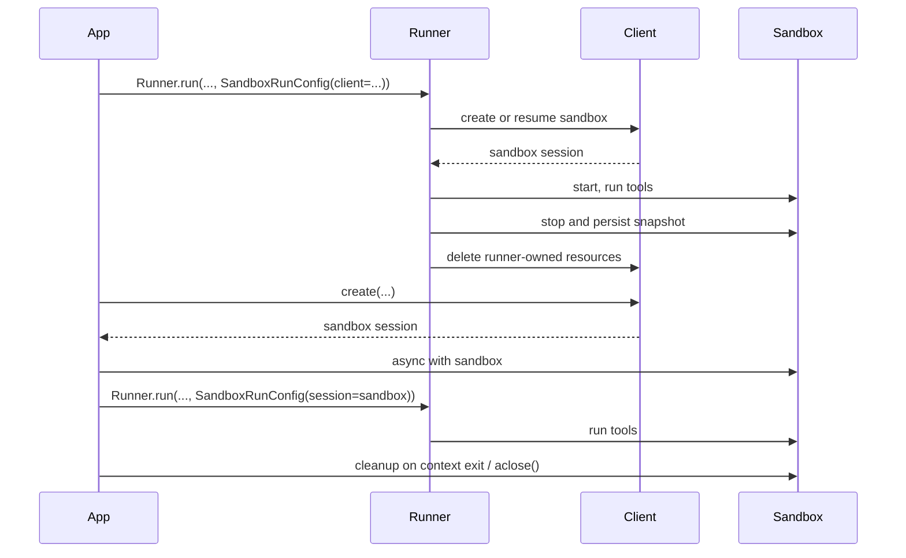

---
search:
  exclude: true
---
# 概念

!!! warning "Beta 功能"

    沙箱智能体目前处于 Beta 阶段。在正式发布前，API 细节、默认值和支持的能力可能会发生变化，并且后续会逐步提供更多高级功能。

现代智能体在能够操作文件系统中的真实文件时表现最佳。**沙箱智能体**可以使用专用工具和 shell 命令搜索及操作大型文档集、编辑文件、生成产物并运行命令。沙箱为模型提供持久化工作区，智能体可使用该工作区代您完成工作。Agents SDK 中的沙箱智能体可帮助您轻松运行与沙箱环境配对的智能体，方便您将所需文件放入文件系统，并对沙箱进行编排，从而轻松地大规模启动、停止和恢复任务。

您可以围绕智能体所需的数据定义工作区。工作区可以从 GitHub 仓库、本地文件和目录、合成任务文件、S3 或 Azure Blob Storage 等远程文件系统，以及您提供的其他沙箱输入开始构建。

<div class="sandbox-harness-image" markdown="1">


</div>

`SandboxAgent` 仍然是 `Agent`。它保留常规智能体接口，例如 `instructions`、`prompt`、`tools`、`handoffs`、`mcp_servers`、`model_settings`、`output_type`、安全防护措施和钩子，并且仍通过常规 `Runner` API 运行。变化的是执行边界：

- `SandboxAgent` 定义智能体本身：常规智能体配置，加上 `default_manifest`、`base_instructions`、`run_as` 等沙箱专属默认值，以及文件系统工具、shell 访问、技能、记忆或压缩等能力。
- `Manifest` 声明新沙箱工作区所需的初始内容和布局，包括文件、仓库、挂载和环境。
- 沙箱会话是运行命令和更改文件的实时隔离环境。
- [`SandboxRunConfig`][agents.run_config.SandboxRunConfig] 决定本次运行如何获得该沙箱会话，例如直接注入、从序列化的沙箱会话状态重新连接，或通过沙箱客户端创建新的沙箱会话。
- 保存的沙箱状态和快照使后续运行可以重新连接到先前的工作，或从保存的内容为新的沙箱会话设定初始状态。

`Manifest` 是新会话的工作区契约，而不是每个实时沙箱的完整事实来源。某次运行的有效工作区也可以来自复用的沙箱会话、序列化的沙箱会话状态，或运行时选择的快照。

在本页中，“沙箱会话”指由沙箱客户端管理的实时执行环境。它不同于[会话](../sessions/index.md)中所述的 SDK 对话式 [`Session`][agents.memory.session.Session] 接口。

外层运行时仍负责审批、追踪、任务转移，以及跟踪恢复运行所需的状态。沙箱会话负责命令、文件更改和环境隔离。这种职责划分是该模型的核心部分。

### 各组件的协作方式

沙箱运行将智能体定义与每次运行的沙箱配置结合起来。运行器会准备智能体，将其绑定到实时沙箱会话，并可保存状态供后续运行使用。



沙箱专属默认值保留在 `SandboxAgent` 中。每次运行的沙箱会话选项保留在 `SandboxRunConfig` 中。

可以从三个阶段理解其生命周期：

1. 使用 `SandboxAgent`、`Manifest` 和能力定义智能体及新工作区契约。
2. 向 `Runner` 提供 `SandboxRunConfig` 来执行运行，由其注入、恢复或创建沙箱会话。
3. 后续从运行器管理的 `RunState`、显式沙箱 `session_state` 或保存的工作区快照继续运行。

如果 shell 访问只是偶尔使用的一项工具，请先使用[工具指南](../tools.md)中的托管 shell。当工作区隔离、沙箱客户端选择或沙箱会话恢复行为属于设计的一部分时，请使用沙箱智能体。

## 适用场景

沙箱智能体非常适合以工作区为中心的工作流，例如：

- 编码和调试，例如编排对 GitHub 仓库中问题报告的自动修复，并运行针对性测试
- 文档处理和编辑，例如从用户的财务文档中提取信息并创建填写完成的税务表单草稿
- 基于文件的审查或分析，例如在回答前检查入职材料包、生成的报告或产物包
- 隔离的多智能体模式，例如为每个审查智能体或编码子智能体提供各自的工作区
- 多步骤工作区任务，例如在一次运行中修复错误，之后添加回归测试，或从快照或沙箱会话状态恢复

如果您不需要访问文件或有状态、可变的文件系统，请继续使用 `Agent`。如果 shell 访问只是偶尔需要的一项能力，请添加托管 shell；如果工作区边界本身就是功能的一部分，请使用沙箱智能体。

## 沙箱客户端选择

在 macOS 或 Linux 上进行本地开发时，请从 `UnixLocalSandboxClient` 开始。在 Windows 上，请改用 `DockerSandboxClient` 或托管提供商。在任何受支持的平台上，当您需要容器隔离或镜像一致性时，请迁移到 `DockerSandboxClient`；当您需要由提供商管理的执行环境时，请使用托管提供商。

在大多数情况下，`SandboxAgent` 定义保持不变，仅需在 [`SandboxRunConfig`][agents.run_config.SandboxRunConfig] 中更改沙箱客户端及其选项。有关本地、Docker、托管和远程挂载选项，请参阅[沙箱客户端](clients.md)。

## 核心组件

<div class="sandbox-nowrap-first-column-table" markdown="1">

| 层 | 主要 SDK 组件 | 解答的问题 |
| --- | --- | --- |
| 智能体定义 | `SandboxAgent`、`Manifest`、能力 | 将运行哪个智能体，以及它应从什么样的新会话工作区契约开始？ |
| 沙箱执行 | `SandboxRunConfig`、沙箱客户端和实时沙箱会话 | 本次运行如何获得实时沙箱会话，以及工作在哪里执行？ |
| 保存的沙箱状态 | `RunState` 沙箱载荷、`session_state` 和快照 | 此工作流如何重新连接到先前的沙箱工作，或根据保存的内容为新沙箱会话设定初始状态？ |

</div>

主要 SDK 组件与这些层的对应关系如下：

<div class="sandbox-nowrap-first-column-table" markdown="1">

| 组件 | 负责的内容 | 应询问的问题 |
| --- | --- | --- |
| [`SandboxAgent`][agents.sandbox.sandbox_agent.SandboxAgent] | 智能体定义 | 此智能体应该做什么，哪些默认值应随它一起使用？ |
| [`Manifest`][agents.sandbox.manifest.Manifest] | 新会话工作区中的文件和文件夹 | 运行开始时，文件系统中应存在哪些文件和文件夹？ |
| [`Capability`][agents.sandbox.capabilities.capability.Capability] | 沙箱原生行为 | 应为此智能体附加哪些工具、指令片段或运行时行为？ |
| [`SandboxRunConfig`][agents.run_config.SandboxRunConfig] | 每次运行的沙箱客户端和沙箱会话来源 | 本次运行应注入、恢复还是创建沙箱会话？ |
| [`RunState`][agents.run_state.RunState] | 由运行器管理的已保存沙箱状态 | 我是否正在恢复先前由运行器管理的工作流，并自动将其沙箱状态延续下去？ |
| [`SandboxRunConfig.session_state`][agents.run_config.SandboxRunConfig.session_state] | 显式序列化的沙箱会话状态 | 我是否希望从已在 `RunState` 外部序列化的沙箱状态恢复？ |
| [`SandboxRunConfig.snapshot`][agents.run_config.SandboxRunConfig.snapshot] | 用于新沙箱会话的已保存工作区内容 | 新沙箱会话是否应从保存的文件和产物开始？ |

</div>

实用的设计顺序如下：

1. 使用 `Manifest` 定义新会话工作区契约。
2. 使用 `SandboxAgent` 定义智能体。
3. 添加内置或自定义能力。
4. 在 `RunConfig(sandbox=SandboxRunConfig(...))` 中决定每次运行应如何获取沙箱会话。

## 沙箱运行的准备过程

运行时，运行器会将该定义转换为由沙箱支持的具体运行：

1. 它从 `SandboxRunConfig` 解析沙箱会话。如果您传入 `session=...`，它会复用该实时沙箱会话。否则，它会使用 `client=...` 创建或恢复沙箱会话。
2. 它确定本次运行的有效工作区输入。如果运行注入或恢复了沙箱会话，则以该现有沙箱状态为准。否则，运行器会从一次性清单覆盖项或 `agent.default_manifest` 开始。这就是为什么仅靠 `Manifest` 无法定义每次运行最终的实时工作区。
3. 它允许能力处理生成的清单。这样，能力便可在最终智能体准备完成前添加文件、挂载或其他工作区范围的行为。
4. 它按固定顺序构建最终指令：SDK 的默认沙箱提示词；如果您显式覆盖，则使用 `base_instructions`；之后是 `instructions`、能力指令片段、任何远程挂载策略文本，最后是渲染后的文件系统树。
5. 它将能力工具绑定到实时沙箱会话，并通过常规 `Runner` API 运行准备好的智能体。

沙箱不会改变轮次的含义。一个轮次仍是一次模型步骤，而不是一条 shell 命令或一次沙箱操作。沙箱侧操作与轮次之间没有固定的 1:1 映射：有些工作可能始终留在沙箱执行层中，而其他操作会返回需要另一次模型步骤的信息，例如工具结果、审批或其他类型的状态。实际而言，只有在沙箱工作完成后，智能体运行时还需要另一次模型响应时，才会消耗另一个轮次。

这些准备步骤说明了为什么在设计 `SandboxAgent` 时，`default_manifest`、`instructions`、`base_instructions`、`capabilities` 和 `run_as` 是需要重点考虑的主要沙箱专属选项。

## `SandboxAgent` 选项

除了常规 `Agent` 字段外，还提供以下沙箱专属选项：

<div class="sandbox-nowrap-first-column-table" markdown="1">

| 选项 | 最佳用途 |
| --- | --- |
| `default_manifest` | 运行器创建的新沙箱会话所使用的默认工作区。 |
| `instructions` | 附加在 SDK 沙箱提示词之后的额外角色、工作流和成功标准。 |
| `base_instructions` | 替换 SDK 沙箱提示词的高级逃生舱口。 |
| `capabilities` | 应随此智能体一起使用的沙箱原生工具和行为。 |
| `run_as` | 用于 shell 命令、文件读取和补丁等面向模型的沙箱工具的用户身份。 |

</div>

沙箱客户端选择、沙箱会话复用、清单覆盖和快照选择应放在 [`SandboxRunConfig`][agents.run_config.SandboxRunConfig] 中，而不是智能体上。

### `default_manifest`

`default_manifest` 是运行器为此智能体创建新沙箱会话时使用的默认 [`Manifest`][agents.sandbox.manifest.Manifest]。请使用它指定智能体通常应具备的初始文件、仓库、辅助材料、输出目录和挂载。

这只是默认值。运行可以使用 `SandboxRunConfig(manifest=...)` 覆盖它，而复用或恢复的沙箱会话会保留其现有工作区状态。

### `instructions` 和 `base_instructions`

对于应在不同提示词之间保持不变的简短规则，请使用 `instructions`。在 `SandboxAgent` 中，这些指令会附加在 SDK 的沙箱基础提示词之后，因此您可以保留内置沙箱指南，同时添加自己的角色、工作流和成功标准。

仅当您希望替换 SDK 沙箱基础提示词时，才使用 `base_instructions`。大多数智能体不应设置它。

<div class="sandbox-nowrap-first-column-table" markdown="1">

| 放置位置 | 用途 | 示例 |
| --- | --- | --- |
| `instructions` | 智能体的稳定角色、工作流规则和成功标准。 | “检查入职文档，然后进行任务转移。”“将最终文件写入 `output/`。” |
| `base_instructions` | 完整替换 SDK 沙箱基础提示词。 | 自定义底层沙箱包装器提示词。 |
| 用户提示词 | 本次运行的一次性请求。 | “总结此工作区。” |
| 清单中的工作区文件 | 较长的任务规范、仓库本地指令或范围明确的参考材料。 | `repo/task.md`、文档包、样本材料包。 |

</div>

`instructions` 的良好用法包括：

- [examples/sandbox/unix_local_pty.py](https://github.com/openai/openai-agents-python/blob/main/examples/sandbox/unix_local_pty.py) 在 PTY 状态很重要时，让智能体始终停留在同一个交互式进程中。
- [examples/sandbox/handoffs.py](https://github.com/openai/openai-agents-python/blob/main/examples/sandbox/handoffs.py) 禁止沙箱审查智能体在检查后直接回答用户。
- [examples/sandbox/tax_prep.py](https://github.com/openai/openai-agents-python/blob/main/examples/sandbox/tax_prep.py) 要求最终填写好的文件实际写入 `output/`。
- [examples/sandbox/docs/coding_task.py](https://github.com/openai/openai-agents-python/blob/main/examples/sandbox/docs/coding_task.py) 固定确切的验证命令，并明确补丁路径相对于工作区根目录。

请避免将用户的一次性任务复制到 `instructions`、嵌入应放入清单的长篇参考材料、重复说明内置能力已经注入的工具文档，或混入模型在运行时不需要的本地安装说明。

如果省略 `instructions`，SDK 仍会包含默认沙箱提示词。这对于底层包装器已经足够，但大多数面向用户的智能体仍应提供显式的 `instructions`。

### `capabilities`

能力可将沙箱原生行为附加到 `SandboxAgent`。它们可以在运行开始前塑造工作区、附加沙箱专属指令、公开绑定到实时沙箱会话的工具，以及调整该智能体的模型行为或输入处理。

内置能力包括：

<div class="sandbox-nowrap-first-column-table" markdown="1">

| 能力 | 添加时机 | 说明 |
| --- | --- | --- |
| `Shell` | 智能体需要 shell 访问。 | 添加 `exec_command`；当沙箱客户端支持 PTY 交互时，还会添加 `write_stdin`。 |
| `Filesystem` | 智能体需要编辑文件或检查本地图像。 | 添加 `apply_patch` 和 `view_image`；补丁路径相对于工作区根目录。 |
| `Skills` | 您希望在沙箱中发现并具体化技能。 | 应优先使用此能力，而不是手动挂载 `.agents` 或 `.agents/skills`；`Skills` 会为您建立技能索引并将其具体化到沙箱中。 |
| `Memory` | 后续运行应读取或生成记忆产物。 | 需要 `Shell`；在运行期间更新记忆产物还需要 `Filesystem`。 |
| `Compaction` | 长时间运行的流程需要在压缩项之后裁剪上下文。 | 调整模型采样和输入处理。 |

</div>

默认情况下，`SandboxAgent.capabilities` 使用 `Capabilities.default()`，其中包括 `Filesystem()`、`Shell()` 和 `Compaction()`。如果您传入 `capabilities=[...]`，该列表会替换默认列表，因此请包含仍要使用的所有默认能力。

对于技能，请根据您希望其具体化的方式选择来源：

- `Skills(lazy_from=LocalDirLazySkillSource(...))` 是较大本地技能目录的良好默认选项，因为模型可以先发现索引，然后只加载所需内容。
- `LocalDirLazySkillSource(source=LocalDir(src=...))` 从运行 SDK 进程的文件系统中读取。请传入原始宿主机侧技能目录，而不是仅存在于沙箱镜像或工作区内的路径。
- `Skills(from_=LocalDir(src=...))` 更适合您希望预先暂存的小型本地包。
- 当技能本身应来自仓库时，`Skills(from_=GitRepo(repo=..., ref=...))` 是合适的选择。

`LocalDir.src` 是 SDK 宿主机上的源路径。`skills_path` 是沙箱工作区内的相对目标路径；调用 `load_skill` 时，技能会暂存于此。

如果您的技能已存储在类似 `.agents/skills/<name>/SKILL.md` 的磁盘路径中，请将 `LocalDir(...)` 指向该源根目录，并仍使用 `Skills(...)` 将其公开。除非现有工作区契约依赖不同的沙箱内布局，否则请保留默认的 `skills_path=".agents"`。

如果内置能力可以满足需求，请优先使用它们。只有当您需要内置能力未覆盖的沙箱专属工具或指令接口时，才应编写自定义能力。

## 概念

### 清单

[`Manifest`][agents.sandbox.manifest.Manifest] 描述新沙箱会话的工作区。它可以设置工作区 `root`、声明文件和目录、复制本地文件、克隆 Git 仓库、附加远程存储挂载、设置环境变量、定义用户或组，以及授予对工作区外特定绝对路径的访问权限。

清单条目路径相对于工作区。它们不能是绝对路径，也不能使用 `..` 跳出工作区，从而使工作区契约可以在本地、Docker 和托管客户端之间移植。

请使用清单条目指定智能体开始工作前所需的材料：

<div class="sandbox-nowrap-first-column-table" markdown="1">

| 清单条目 | 用途 |
| --- | --- |
| `File`、`Dir` | 小型合成输入、辅助文件或输出目录。 |
| `LocalFile`、`LocalDir` | 应具体化到沙箱中的宿主机文件或目录。 |
| `GitRepo` | 应提取到工作区中的仓库。 |
| `S3Mount`、`GCSMount`、`R2Mount`、`AzureBlobMount`、`BoxMount`、`S3FilesMount` 等挂载 | 应显示在沙箱内的外部存储。 |

</div>

`Dir` 根据合成子项在沙箱工作区内创建目录，或创建用作输出位置的目录；它不会从宿主机文件系统读取内容。如果需要将现有宿主机目录复制到沙箱工作区，请使用 `LocalDir`。

默认情况下，`LocalFile.src` 和 `LocalDir.src` 相对于 SDK 进程工作目录进行解析。源必须位于该基础目录下，除非它包含在 `extra_path_grants` 中。这样可以让本地源的具体化与沙箱清单的其他部分保持在相同的宿主机路径信任边界内。

挂载条目描述要公开哪些存储；挂载策略描述沙箱后端如何附加这些存储。有关挂载选项和提供商支持，请参阅[沙箱客户端](clients.md#mounts-and-remote-storage)。

良好的清单设计通常意味着保持工作区契约精简，将较长的任务说明放在 `repo/task.md` 等工作区文件中，并在指令中使用相对工作区路径，例如 `repo/task.md` 或 `output/report.md`。如果智能体使用 `Filesystem` 能力的 `apply_patch` 工具编辑文件，请记住补丁路径相对于沙箱工作区根目录，而不是 shell 的 `workdir`。

仅当智能体需要工作区外的具体绝对路径，或清单需要复制 SDK 进程工作目录之外受信任的本地源时，才使用 `extra_path_grants`。示例包括用于临时工具输出的 `/tmp`、用于只读运行时的 `/opt/toolchain`，或应具体化到沙箱中的已生成技能目录。授权适用于本地源具体化和 SDK 文件 API。当后端能够强制实施文件系统策略时，它也适用于 shell 执行：

```python
from agents.sandbox import Manifest, SandboxPathGrant

manifest = Manifest(
    extra_path_grants=(
        SandboxPathGrant(path="/tmp"),
        SandboxPathGrant(path="/opt/toolchain", read_only=True),
    ),
)
```

当 Docker 应将不同的宿主机绝对路径绑定挂载到容器内的 POSIX 绝对路径 `path` 时，请设置 `host_path`。`UnixLocalSandboxClient` 仅支持两个路径相同的纯路径授权，并拒绝 `host_path`。对于沙箱不应修改的宿主机数据，请使用 `read_only=True`；如果复制即可满足需求，则使用 `LocalFile` 或 `LocalDir`。

应将包含 `extra_path_grants` 的清单视为受信任配置。除非应用已经批准这些宿主机路径，否则请勿从模型输出或其他不受信任的载荷中加载授权。

快照和 `persist_workspace()` 仍然只包含工作区根目录。额外授权的路径是运行时访问权限，而不是持久化工作区状态。

### 权限

`Permissions` 控制清单条目的文件系统权限。它针对沙箱具体化的文件，而不是模型权限、审批策略或 API 凭据。

默认情况下，清单条目对所有者可读、可写、可执行，对组和其他用户可读、可执行。当暂存文件应为私有、只读或可执行文件时，请覆盖此设置：

```python
from agents.sandbox import FileMode, Permissions
from agents.sandbox.entries import File

private_notes = File(
    content=b"internal notes",
    permissions=Permissions(
        owner=FileMode.READ | FileMode.WRITE,
        group=FileMode.NONE,
        other=FileMode.NONE,
    ),
)
```

`Permissions` 分别存储所有者、组和其他用户的权限位，以及该条目是否为目录。您可以直接构建它、使用 `Permissions.from_str(...)` 从模式字符串解析，或使用 `Permissions.from_mode(...)` 从操作系统模式派生。

用户是可以在沙箱中执行工作的身份。如果您希望该身份存在于沙箱中，请向清单添加 `User`；随后，当 shell 命令、文件读取和补丁等面向模型的沙箱工具应以该用户身份运行时，请设置 `SandboxAgent.run_as`。如果 `run_as` 指向清单中尚不存在的用户，运行器会自动将其添加到有效清单。

```python
from agents import Runner
from agents.run import RunConfig
from agents.sandbox import FileMode, Manifest, Permissions, SandboxAgent, SandboxRunConfig, User
from agents.sandbox.entries import Dir, LocalDir
from agents.sandbox.sandboxes.unix_local import UnixLocalSandboxClient

analyst = User(name="analyst")

agent = SandboxAgent(
    name="Dataroom analyst",
    instructions="Review the files in `dataroom/` and write findings to `output/`.",
    default_manifest=Manifest(
        # Declare the sandbox user so manifest entries can grant access to it.
        users=[analyst],
        entries={
            "dataroom": LocalDir(
                src="./dataroom",
                # Let the analyst traverse and read the mounted dataroom, but not edit it.
                group=analyst,
                permissions=Permissions(
                    owner=FileMode.READ | FileMode.EXEC,
                    group=FileMode.READ | FileMode.EXEC,
                    other=FileMode.NONE,
                ),
            ),
            "output": Dir(
                # Give the analyst a writable scratch/output directory for artifacts.
                group=analyst,
                permissions=Permissions(
                    owner=FileMode.ALL,
                    group=FileMode.ALL,
                    other=FileMode.NONE,
                ),
            ),
        },
    ),
    # Run model-facing sandbox actions as this user, so those permissions apply.
    run_as=analyst,
)

result = await Runner.run(
    agent,
    "Summarize the contracts and call out renewal dates.",
    run_config=RunConfig(
        sandbox=SandboxRunConfig(client=UnixLocalSandboxClient()),
    ),
)
```

如果还需要文件级共享规则，请将用户与清单组及条目的 `group` 元数据结合使用。`run_as` 用户控制谁执行沙箱原生操作；沙箱具体化工作区后，`Permissions` 控制该用户可以读取、写入或执行哪些文件。

### SnapshotSpec

`SnapshotSpec` 指示新沙箱会话应从何处恢复保存的工作区内容，以及将内容持久化回何处。它是沙箱工作区的快照策略，而 `session_state` 是用于恢复特定沙箱后端的序列化连接状态。

对于本地持久快照，请使用 `LocalSnapshotSpec`；当您的应用提供远程快照客户端时，请使用 `RemoteSnapshotSpec`。本地快照设置不可用时，会使用空操作快照作为回退；不希望持久化工作区快照的高级调用方也可以显式使用它。

```python
from pathlib import Path

from agents.run import RunConfig
from agents.sandbox import LocalSnapshotSpec, SandboxRunConfig
from agents.sandbox.sandboxes.unix_local import UnixLocalSandboxClient

run_config = RunConfig(
    sandbox=SandboxRunConfig(
        client=UnixLocalSandboxClient(),
        snapshot=LocalSnapshotSpec(base_path=Path("/tmp/my-sandbox-snapshots")),
    )
)
```

当运行器创建新沙箱会话时，沙箱客户端会为该会话构建快照实例。启动时，如果快照可恢复，沙箱会先恢复保存的工作区内容，然后再继续运行。清理时，由运行器拥有的沙箱会话会归档工作区，并通过快照将其持久化。

如果省略 `snapshot`，运行时会在可行时尝试使用默认本地快照位置。如果无法完成设置，则回退为空操作快照。挂载路径和临时路径不会作为持久化工作区内容复制到快照中。

### 沙箱生命周期

生命周期分为两种模式：**SDK 所有**和**开发者所有**。

<div class="sandbox-lifecycle-diagram" markdown="1">



</div>

当沙箱只需在一次运行期间存活时，请使用 SDK 所有的生命周期。传入 `client`，以及可选的 `manifest` 和 `snapshot`，再加上所需的任何客户端 `options`；运行器会创建或恢复沙箱、启动沙箱、运行智能体、持久化由快照支持的工作区状态、结束沙箱会话，并让客户端清理由运行器拥有的资源。

```python
result = await Runner.run(
    agent,
    "Inspect the workspace and summarize what changed.",
    run_config=RunConfig(
        sandbox=SandboxRunConfig(client=UnixLocalSandboxClient()),
    ),
)
```

当您希望提前创建沙箱、在多次运行中复用同一个实时沙箱、在运行后检查文件、通过自行创建的沙箱进行流式传输，或精确决定清理时机时，请使用开发者所有的生命周期。传入 `session=...` 会指示运行器使用该实时沙箱，但不会代您关闭它。

```python
sandbox = await client.create(manifest=agent.default_manifest)

async with sandbox:
    run_config = RunConfig(sandbox=SandboxRunConfig(session=sandbox))
    await Runner.run(agent, "Analyze the files.", run_config=run_config)
    await Runner.run(agent, "Write the final report.", run_config=run_config)
```

上下文管理器是常用形式：进入时启动沙箱，退出时运行会话清理生命周期。如果您的应用无法使用上下文管理器，请直接调用生命周期方法：

```python
sandbox = await client.create(
    manifest=agent.default_manifest,
    snapshot=LocalSnapshotSpec(base_path=Path("/tmp/my-sandbox-snapshots")),
)
try:
    await sandbox.start()
    await Runner.run(
        agent,
        "Analyze the files.",
        run_config=RunConfig(sandbox=SandboxRunConfig(session=sandbox)),
    )
    # Persist a checkpoint of the live workspace before doing more work.
    # `aclose()` also calls `stop()`, so this is only needed for an explicit mid-lifecycle save.
    await sandbox.stop()
finally:
    await sandbox.aclose()
```

`stop()` 只会持久化由快照支持的工作区内容；它不会销毁沙箱。`aclose()` 是完整的会话清理路径：它运行停止前钩子、调用 `stop()`、关闭沙箱资源并关闭会话范围的依赖项。

## `SandboxRunConfig` 选项

[`SandboxRunConfig`][agents.run_config.SandboxRunConfig] 保存每次运行的选项，用于决定沙箱会话的来源，以及应如何初始化新会话。

### 沙箱来源

以下选项决定运行器应复用、恢复还是创建沙箱会话：

<div class="sandbox-nowrap-first-column-table" markdown="1">

| 选项 | 使用时机 | 说明 |
| --- | --- | --- |
| `client` | 您希望运行器代您创建、恢复和清理沙箱会话。 | 除非您提供实时沙箱 `session`，否则此项为必需。 |
| `session` | 您已经自行创建了实时沙箱会话。 | 生命周期由调用方负责；运行器复用该实时沙箱会话。 |
| `session_state` | 您有序列化的沙箱会话状态，但没有实时沙箱会话对象。 | 需要 `client`；运行器从该显式状态恢复，并负责恢复后会话的生命周期。 |

</div>

实际使用中，运行器按以下顺序解析沙箱会话：

1. 如果注入 `run_config.sandbox.session`，则直接复用该实时沙箱会话。
2. 否则，如果运行正从 `RunState` 恢复，则恢复其中存储的沙箱会话状态。
3. 否则，如果传入 `run_config.sandbox.session_state`，运行器会从该显式序列化沙箱会话状态恢复。
4. 否则，运行器会创建新沙箱会话。对于该新会话，如果提供了 `run_config.sandbox.manifest`，则使用它；否则使用 `agent.default_manifest`。

### 新会话输入

以下选项仅在运行器创建新沙箱会话时生效：

<div class="sandbox-nowrap-first-column-table" markdown="1">

| 选项 | 使用时机 | 说明 |
| --- | --- | --- |
| `manifest` | 您希望一次性覆盖新会话工作区。 | 省略时回退到 `agent.default_manifest`。 |
| `snapshot` | 新沙箱会话应从快照设定初始状态。 | 适用于类似恢复的流程或远程快照客户端。 |
| `options` | 沙箱客户端需要创建时选项。 | 常用于 Docker 镜像、Modal 应用名称、E2B 模板、超时和类似的客户端专属设置。 |

</div>

### 具体化控制

`concurrency_limits` 控制可并行运行的沙箱具体化工作量。当大型清单或本地目录复制需要更严格的资源控制时，请使用 `SandboxConcurrencyLimits(manifest_entries=..., local_dir_files=...)`。将任一值设置为 `None` 可禁用对应的特定限制。

`archive_limits` 控制 SDK 侧针对归档提取的资源检查。将其设置为 `archive_limits=SandboxArchiveLimits()` 可启用 SDK 默认阈值；当归档需要更严格的资源控制时，也可传入 `SandboxArchiveLimits(max_input_bytes=..., max_extracted_bytes=..., max_members=...)` 等显式值。保留 `archive_limits=None` 可维持不设 SDK 归档资源限制的默认行为；也可以将单个字段设置为 `None`，仅禁用对应限制。

请注意以下几点：

- 新会话：`manifest=` 和 `snapshot=` 仅在运行器创建新沙箱会话时适用。
- 恢复与快照：`session_state=` 重新连接到先前序列化的沙箱状态，而 `snapshot=` 根据保存的工作区内容为新沙箱会话设定初始状态。
- 客户端专属选项：`options=` 取决于沙箱客户端；Docker 和许多托管客户端都需要它。
- 注入的实时会话：如果传入正在运行的沙箱 `session`，由能力驱动的清单更新可以添加兼容的非挂载条目。它们不能更改 `manifest.root`、`manifest.environment`、`manifest.users` 或 `manifest.groups`；不能删除现有条目；不能替换条目类型；也不能添加或更改挂载条目。
- 运行器 API：`SandboxAgent` 执行仍使用常规 `Runner.run()`、`Runner.run_sync()` 和 `Runner.run_streamed()` API。

## 完整示例：编码任务

以下编码类示例是一个良好的默认起点：

```python
import asyncio
from pathlib import Path

from agents import ModelSettings, Runner
from agents.run import RunConfig
from agents.sandbox import Manifest, SandboxAgent, SandboxRunConfig
from agents.sandbox.capabilities import (
    Capabilities,
    LocalDirLazySkillSource,
    Skills,
)
from agents.sandbox.entries import LocalDir
from agents.sandbox.sandboxes.unix_local import UnixLocalSandboxClient

EXAMPLE_DIR = Path(__file__).resolve().parent
HOST_REPO_DIR = EXAMPLE_DIR / "repo"
HOST_SKILLS_DIR = EXAMPLE_DIR / "skills"
TARGET_TEST_CMD = "sh tests/test_credit_note.sh"


def build_agent(model: str) -> SandboxAgent[None]:
    return SandboxAgent(
        name="Sandbox engineer",
        model=model,
        instructions=(
            "Inspect the repo, make the smallest correct change, run the most relevant checks, "
            "and summarize the file changes and risks. "
            "Read `repo/task.md` before editing files. Stay grounded in the repository, preserve "
            "existing behavior, and mention the exact verification command you ran. "
            "Use the `$credit-note-fixer` skill before editing files. If the repo lives under "
            "`repo/`, remember that `apply_patch` paths stay relative to the sandbox workspace "
            "root, so edits still target `repo/...`."
        ),
        # Put repos and task files in the manifest.
        default_manifest=Manifest(
            entries={
                "repo": LocalDir(src=HOST_REPO_DIR),
            }
        ),
        capabilities=Capabilities.default() + [
            Skills(
                lazy_from=LocalDirLazySkillSource(
                    # This is a host path read by the SDK process.
                    # Requested skills are copied into `skills_path` in the sandbox.
                    source=LocalDir(src=HOST_SKILLS_DIR),
                )
            ),
        ],
        model_settings=ModelSettings(tool_choice="required"),
    )


async def main(model: str, prompt: str) -> None:
    result = await Runner.run(
        build_agent(model),
        prompt,
        run_config=RunConfig(
            sandbox=SandboxRunConfig(client=UnixLocalSandboxClient()),
            workflow_name="Sandbox coding example",
        ),
    )
    print(result.final_output)


if __name__ == "__main__":
    asyncio.run(
        main(
            model="gpt-5.6-sol",
            prompt=(
                "Open `repo/task.md`, use the `$credit-note-fixer` skill, fix the bug, "
                f"run `{TARGET_TEST_CMD}`, and summarize the change."
            ),
        )
    )
```

请参阅 [examples/sandbox/docs/coding_task.py](https://github.com/openai/openai-agents-python/blob/main/examples/sandbox/docs/coding_task.py)。它使用基于 shell 的小型仓库，因此可以在 Unix 本地运行中以确定性的方式验证示例。您的实际任务仓库当然可以使用 Python、JavaScript 或其他任何语言。

## 常见模式

请从上面的完整示例开始。在许多情况下，可以保持同一个 `SandboxAgent` 不变，只更改沙箱客户端、沙箱会话来源或工作区来源。

### 沙箱客户端切换

保持智能体定义不变，仅更改运行配置。当您需要容器隔离或镜像一致性时使用 Docker；当您需要由提供商管理的执行环境时使用托管提供商。有关代码示例和提供商选项，请参阅[沙箱客户端](clients.md)。

### 工作区覆盖

保持智能体定义不变，仅替换新会话清单：

```python
from agents.run import RunConfig
from agents.sandbox import Manifest, SandboxRunConfig
from agents.sandbox.entries import GitRepo
from agents.sandbox.sandboxes.unix_local import UnixLocalSandboxClient

run_config = RunConfig(
    sandbox=SandboxRunConfig(
        client=UnixLocalSandboxClient(),
        manifest=Manifest(
            entries={
                "repo": GitRepo(repo="openai/openai-agents-python", ref="main"),
            }
        ),
    ),
)
```

当同一个智能体角色应针对不同仓库、材料包或任务包运行，而无需重新构建智能体时，请使用此模式。上面经过验证的编码示例展示了相同模式，但使用 `default_manifest`，而不是一次性覆盖项。

### 沙箱会话注入

当您需要显式控制生命周期、运行后检查或复制输出时，请注入实时沙箱会话：

```python
from agents import Runner
from agents.run import RunConfig
from agents.sandbox import SandboxRunConfig
from agents.sandbox.sandboxes.unix_local import UnixLocalSandboxClient

client = UnixLocalSandboxClient()
sandbox = await client.create(manifest=agent.default_manifest)

async with sandbox:
    result = await Runner.run(
        agent,
        prompt,
        run_config=RunConfig(
            sandbox=SandboxRunConfig(session=sandbox),
        ),
    )
```

当您希望在运行后检查工作区，或通过已启动的沙箱会话进行流式传输时，请使用此模式。请参阅 [examples/sandbox/docs/coding_task.py](https://github.com/openai/openai-agents-python/blob/main/examples/sandbox/docs/coding_task.py) 和 [examples/sandbox/docker/docker_runner.py](https://github.com/openai/openai-agents-python/blob/main/examples/sandbox/docker/docker_runner.py)。

### 会话状态恢复

如果您已在 `RunState` 外部序列化沙箱状态，可让运行器从该状态重新连接：

```python
from agents.run import RunConfig
from agents.sandbox import SandboxRunConfig

serialized = load_saved_payload()
restored_state = client.deserialize_session_state(serialized)

run_config = RunConfig(
    sandbox=SandboxRunConfig(
        client=client,
        session_state=restored_state,
    ),
)
```

当沙箱状态存储在您自己的存储系统或作业系统中，并且希望 `Runner` 直接从中恢复时，请使用此模式。有关序列化和反序列化流程，请参阅 [examples/sandbox/extensions/blaxel_runner.py](https://github.com/openai/openai-agents-python/blob/main/examples/sandbox/extensions/blaxel_runner.py)。

会话状态序列化会省略原生 `host_path` 值。要恢复由宿主机支持的授权，请通过 `SandboxRunConfig.manifest` 或 `agent.default_manifest` 提供当前受信任清单；否则，恢复会在沙箱启动前失败。切勿从序列化输入或其他不受信任的输入中派生宿主机路径。

会话状态和 `RunState` 序列化还会移除云挂载凭据、含凭据的辅助配置，以及容器内凭据公开确认。对于支持恢复已挂载会话的后端，当状态中包含经过编辑的挂载权限时，请通过 `SandboxRunConfig.manifest` 或 `agent.default_manifest` 提供当前受信任清单。当名为 `"data"` 的挂载条目需要挂载范围确认时，请在恢复前通过 `trusted_manifest = trusted_manifest.with_in_container_mount_credential_exposure_acknowledged("data")` 保留复制的清单。对于广泛权限，请使用 `trusted_manifest = trusted_manifest.with_in_container_mount_broad_credential_exposure_acknowledged("data")`；当挂载同时使用这两类权限时，请同时调用这两个方法。请传入需要确认的每一个确切挂载路径。仅当当前受信任清单与持久化状态具有完全相同的不含凭据的挂载拓扑时，Agents SDK 才会恢复凭据。缺失或不匹配的受信任配置会导致恢复在沙箱启动前失败；序列化状态本身绝不会授予权限。`VercelSandboxClient` 无法恢复已挂载会话，因此应改为使用受信任清单启动新沙箱。

### 快照启动

根据保存的文件和产物为新沙箱设定初始状态：

```python
from pathlib import Path

from agents.run import RunConfig
from agents.sandbox import LocalSnapshotSpec, SandboxRunConfig
from agents.sandbox.sandboxes.unix_local import UnixLocalSandboxClient

run_config = RunConfig(
    sandbox=SandboxRunConfig(
        client=UnixLocalSandboxClient(),
        snapshot=LocalSnapshotSpec(base_path=Path("/tmp/my-sandbox-snapshot")),
    ),
)
```

当创建新沙箱会话的运行应从保存的工作区内容开始，而不是仅从 `agent.default_manifest` 开始时，请使用此模式。有关本地快照流程，请参阅 [examples/sandbox/memory.py](https://github.com/openai/openai-agents-python/blob/main/examples/sandbox/memory.py)；有关远程快照客户端，请参阅 [examples/sandbox/sandbox_agent_with_remote_snapshot.py](https://github.com/openai/openai-agents-python/blob/main/examples/sandbox/sandbox_agent_with_remote_snapshot.py)。

### 从 Git 加载技能

将本地技能来源替换为由仓库支持的来源：

```python
from agents.sandbox.capabilities import Capabilities, Skills
from agents.sandbox.entries import GitRepo

capabilities = Capabilities.default() + [
    Skills(from_=GitRepo(repo="sdcoffey/tax-prep-skills", ref="main")),
]
```

当技能包有自己的发布周期，或应在多个沙箱之间共享时，请使用此模式。请参阅 [examples/sandbox/tax_prep.py](https://github.com/openai/openai-agents-python/blob/main/examples/sandbox/tax_prep.py)。

### 工具公开

工具智能体既可以使用自己的沙箱边界，也可以复用父运行中的实时沙箱。复用适合快速、只读的探索智能体：它可以检查父运行正在使用的确切工作区，而无需承担创建、填充或快照另一个沙箱的成本。

```python
from agents import Runner
from agents.run import RunConfig
from agents.sandbox import FileMode, Manifest, Permissions, SandboxAgent, SandboxRunConfig, User
from agents.sandbox.entries import Dir, File
from agents.sandbox.sandboxes.unix_local import UnixLocalSandboxClient

coordinator = User(name="coordinator")
explorer = User(name="explorer")

manifest = Manifest(
    users=[coordinator, explorer],
    entries={
        "pricing_packet": Dir(
            group=coordinator,
            permissions=Permissions(
                owner=FileMode.ALL,
                group=FileMode.ALL,
                other=FileMode.READ | FileMode.EXEC,
                directory=True,
            ),
            children={
                "pricing.md": File(
                    content=b"Pricing packet contents...",
                    group=coordinator,
                    permissions=Permissions(
                        owner=FileMode.ALL,
                        group=FileMode.ALL,
                        other=FileMode.READ,
                    ),
                ),
            },
        ),
        "work": Dir(
            group=coordinator,
            permissions=Permissions(
                owner=FileMode.ALL,
                group=FileMode.ALL,
                other=FileMode.NONE,
                directory=True,
            ),
        ),
    },
)

pricing_explorer = SandboxAgent(
    name="Pricing Explorer",
    instructions="Read `pricing_packet/` and summarize commercial risk. Do not edit files.",
    run_as=explorer,
)

client = UnixLocalSandboxClient()
sandbox = await client.create(manifest=manifest)

async with sandbox:
    shared_run_config = RunConfig(
        sandbox=SandboxRunConfig(session=sandbox),
    )

    orchestrator = SandboxAgent(
        name="Revenue Operations Coordinator",
        instructions="Coordinate the review and write final notes to `work/`.",
        run_as=coordinator,
        tools=[
            pricing_explorer.as_tool(
                tool_name="review_pricing_packet",
                tool_description="Inspect the pricing packet and summarize commercial risk.",
                run_config=shared_run_config,
                max_turns=2,
            ),
        ],
    )

    result = await Runner.run(
        orchestrator,
        "Review the pricing packet, then write final notes to `work/summary.md`.",
        run_config=shared_run_config,
    )
```

此处，父智能体以 `coordinator` 身份运行，探索工具智能体则在同一个实时沙箱会话内以 `explorer` 身份运行。`pricing_packet/` 条目可由 `other` 用户读取，因此探索智能体可以快速检查这些条目，但没有写入权限位。`work/` 目录仅对协调器的用户或组可用，因此父智能体可以写入最终产物，而探索智能体保持只读。

如果工具智能体需要真正的隔离，请为其提供自己的沙箱 `RunConfig`：

```python
from docker import from_env as docker_from_env

from agents.run import RunConfig
from agents.sandbox import SandboxAgent, SandboxRunConfig
from agents.sandbox.sandboxes.docker import DockerSandboxClient, DockerSandboxClientOptions

rollout_agent = SandboxAgent(
    name="Rollout Reviewer",
    instructions="Inspect the rollout packet and summarize implementation risk.",
)

rollout_agent.as_tool(
    tool_name="review_rollout_risk",
    tool_description="Inspect the rollout packet and summarize implementation risk.",
    run_config=RunConfig(
        sandbox=SandboxRunConfig(
            client=DockerSandboxClient(docker_from_env()),
            options=DockerSandboxClientOptions(image="python:3.14-slim"),
        ),
    ),
)
```

当工具智能体应自由修改内容、运行不受信任的命令或使用不同后端或镜像时，请使用独立沙箱。请参阅 [examples/sandbox/sandbox_agents_as_tools.py](https://github.com/openai/openai-agents-python/blob/main/examples/sandbox/sandbox_agents_as_tools.py)。

### 与本地工具和 MCP 组合

保留沙箱工作区，同时在同一智能体上使用常规工具：

```python
from agents.sandbox import SandboxAgent
from agents.sandbox.capabilities import Shell

agent = SandboxAgent(
    name="Workspace reviewer",
    instructions="Inspect the workspace and call host tools when needed.",
    tools=[get_discount_approval_path],
    mcp_servers=[server],
    capabilities=[Shell()],
)
```

当工作区检查只是智能体工作的一部分时，请使用此模式。请参阅 [examples/sandbox/sandbox_agent_with_tools.py](https://github.com/openai/openai-agents-python/blob/main/examples/sandbox/sandbox_agent_with_tools.py)。

## 记忆

当未来的沙箱智能体运行应从先前运行中学习时，请使用 `Memory` 能力。记忆与 SDK 的对话式 `Session` 记忆不同：它会将经验提炼为沙箱工作区中的文件，后续运行可以读取这些文件。

有关设置、读取和生成行为、多轮对话及布局隔离，请参阅[智能体记忆](memory.md)。

## 组合模式

明确单智能体模式后，下一个设计问题是沙箱边界应位于较大系统中的何处。

沙箱智能体仍可与 SDK 的其他部分组合：

- [任务转移](../handoffs.md)：将文档密集型工作从非沙箱接收智能体转移给沙箱审查智能体。
- [Agents as tools](../tools.md#agents-as-tools)：将多个沙箱智能体公开为工具，通常在每次 `Agent.as_tool(...)` 调用中传入 `run_config=RunConfig(sandbox=SandboxRunConfig(...))`，使每个工具拥有自己的沙箱边界。
- [MCP](../mcp.md) 和常规函数工具：沙箱能力可与 `mcp_servers` 和普通 Python 工具共存。
- [智能体运行](../running_agents.md)：沙箱运行仍使用常规 `Runner` API。

以下两种模式尤其常见：

- 非沙箱智能体仅在工作流中需要工作区隔离的部分将任务转移给沙箱智能体
- 编排器将多个沙箱智能体公开为工具，通常每次 `Agent.as_tool(...)` 调用都使用独立的沙箱 `RunConfig`，使每个工具获得自己的隔离工作区

### 轮次与沙箱运行

分别说明任务转移和智能体工具调用有助于理解两者。

使用任务转移时，仍然只有一个顶层运行和一个顶层轮次循环。活跃智能体会发生变化，但运行不会变成嵌套运行。如果非沙箱接收智能体将任务转移给沙箱审查智能体，则同一次运行中的下一次模型调用会针对沙箱智能体进行准备，该沙箱智能体将成为执行下一轮次的智能体。换言之，任务转移会改变同一次运行中由哪个智能体负责下一轮次。请参阅 [examples/sandbox/handoffs.py](https://github.com/openai/openai-agents-python/blob/main/examples/sandbox/handoffs.py)。

使用 `Agent.as_tool(...)` 时，关系则不同。外层编排器使用一个外层轮次来决定调用工具，该工具调用会为沙箱智能体启动嵌套运行。嵌套运行有自己的轮次循环、`max_turns`、审批，并且通常有自己的沙箱 `RunConfig`。它可能在一个嵌套轮次中完成，也可能需要多个轮次。从外层编排器的角度看，所有这些工作仍封装在一次工具调用之后，因此嵌套轮次不会增加外层运行的轮次计数器。请参阅 [examples/sandbox/sandbox_agents_as_tools.py](https://github.com/openai/openai-agents-python/blob/main/examples/sandbox/sandbox_agents_as_tools.py)。

审批行为也遵循相同的职责划分：

- 使用任务转移时，审批仍位于同一个顶层运行中，因为沙箱智能体现在是该运行中的活跃智能体
- 使用 `Agent.as_tool(...)` 时，沙箱工具智能体内部发起的审批仍会显示在外层运行中，但它们来自已存储的嵌套运行状态，并会在外层运行恢复时恢复嵌套沙箱运行

## 延伸阅读

- [快速入门](../sandbox_agents.md)：运行一个沙箱智能体。
- [沙箱客户端](clients.md)：选择本地、Docker、托管和挂载选项。
- [智能体记忆](memory.md)：保留并复用先前沙箱运行中的经验。
- [examples/sandbox/](https://github.com/openai/openai-agents-python/tree/main/examples/sandbox)：可运行的本地、编码、记忆、任务转移和智能体组合模式。