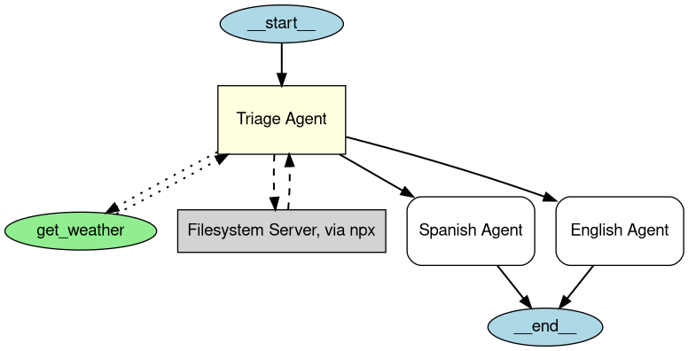

---
search:
  exclude: true
---
# 智能体可视化

智能体可视化功能允许你使用 **Graphviz**，生成智能体及其与其他智能体、工具和MCP服务器之间连接关系的结构化图形表示。这有助于理解应用程序中智能体、工具和任务转移之间的交互方式。

## 安装

安装可选的 `viz` 依赖组：

```bash
pip install "openai-agents[viz]"
```

## 图形生成

你可以使用 `draw_graph` 函数生成智能体可视化图形。此函数会创建一个有向图，其中：

- **智能体**表示为黄色方框。
- **MCP服务器**表示为灰色方框。
- **工具**表示为绿色椭圆。
- **任务转移**表示为从一个智能体指向另一个智能体的有向边。

### 使用示例

```python
import os

from agents import Agent
from agents.decorators import tool
from agents.mcp.server import MCPServerStdio
from agents.extensions.visualization import draw_graph

@tool
def get_weather(city: str) -> str:
    return f"The weather in {city} is sunny."

spanish_agent = Agent(
    name="Spanish agent",
    instructions="You only speak Spanish.",
)

english_agent = Agent(
    name="English agent",
    instructions="You only speak English",
)

current_dir = os.path.dirname(os.path.abspath(__file__))
samples_dir = os.path.join(current_dir, "sample_files")
mcp_server = MCPServerStdio(
    name="Filesystem Server, via npx",
    params={
        "command": "npx",
        "args": ["-y", "@modelcontextprotocol/server-filesystem", samples_dir],
    },
)

triage_agent = Agent(
    name="Triage agent",
    instructions="Handoff to the appropriate agent based on the language of the request.",
    handoffs=[spanish_agent, english_agent],
    tools=[get_weather],
    mcp_servers=[mcp_server],
)

draw_graph(triage_agent)
```



这会生成一幅图形，以可视化方式表示**分诊智能体**的结构及其与子智能体和工具的连接关系。


## 可视化解读

生成的图形包括：

- 表示入口点的**起始节点**（`__start__`）。
- 以黄色填充的**矩形**表示智能体。
- 以绿色填充的**椭圆**表示工具。
- 以灰色填充的**矩形**表示MCP服务器。
- 表示交互的有向边：
  - **实线箭头**表示智能体之间的任务转移。
  - **点线箭头**表示工具调用。
  - **虚线箭头**表示MCP服务器调用。
- 表示执行终止位置的**结束节点**（`__end__`）。

**注意：**较新版本的 `agents` 软件包会渲染MCP服务器，包括已验证此行为的 **v0.2.8**。如果可视化图形中没有显示MCP服务器方框，请升级到最新版本。

## 图形自定义

### 图形显示
默认情况下，`draw_graph` 会内联显示图形。若要在单独的窗口中显示图形，请编写以下代码：

```python
draw_graph(triage_agent).view()
```

### 图形保存
默认情况下，`draw_graph` 会内联显示图形。若要将其保存为文件，请指定文件名：

```python
draw_graph(triage_agent, filename="agent_graph")
```

这会在工作目录中生成 `agent_graph.png`。