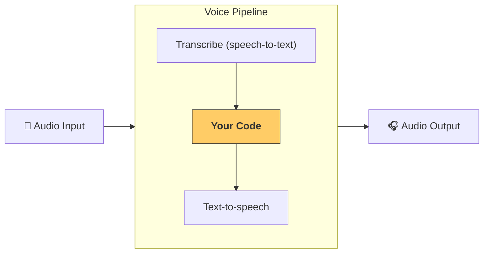

---
search:
  exclude: true
---
# 管线与工作流

[`VoicePipeline`][agents.voice.pipeline.VoicePipeline] 是一个可轻松将智能体工作流转化为语音应用的类。你只需传入要运行的工作流，管线便会负责转录输入音频、检测音频何时结束、在适当的时机调用工作流，并将工作流输出重新转换为音频。



## 管线配置

创建管线时，你可以设置以下几项：

1. [`workflow`][agents.voice.workflow.VoiceWorkflowBase]，即每次转录新音频时运行的代码。
2. 使用的 [`speech-to-text`][agents.voice.model.STTModel] 和 [`text-to-speech`][agents.voice.model.TTSModel] 模型。
3. [`config`][agents.voice.pipeline_config.VoicePipelineConfig]，可用于配置以下内容：
    - 模型提供方，可将模型名称映射到模型
    - 追踪，包括是否禁用追踪、是否上传音频文件、工作流名称、追踪 ID 等
    - TTS 和 STT 模型的设置，例如提示词、语言和使用的数据类型。

## 管线运行

你可以通过 [`run()`][agents.voice.pipeline.VoicePipeline.run] 方法运行管线。该方法允许你传入以下两种形式的音频输入：

1. 当你拥有完整的音频输入，并且只想为其生成结果时，可使用 [`AudioInput`][agents.voice.input.AudioInput]。这适用于不需要检测说话者何时结束发言的场景；例如，使用预录音频，或在一键通话应用中能够明确判断用户何时结束发言。
2. 当你可能需要检测用户何时结束发言时，可使用 [`StreamedAudioInput`][agents.voice.input.StreamedAudioInput]。它允许你在检测到音频分块时将其推送，而语音管线会通过名为“活动检测”的过程，在适当的时机自动运行智能体工作流。

## 结果

语音管线运行的结果是 [`StreamedAudioResult`][agents.voice.result.StreamedAudioResult]。你可以通过此对象在事件发生时对其进行流式传输。[`VoiceStreamEvent`][agents.voice.events.VoiceStreamEvent] 有以下几种类型：

1. [`VoiceStreamEventAudio`][agents.voice.events.VoiceStreamEventAudio]，其中包含一个音频分块。
2. [`VoiceStreamEventLifecycle`][agents.voice.events.VoiceStreamEventLifecycle]，用于通知轮次开始或结束等生命周期事件。
3. [`VoiceStreamEventError`][agents.voice.events.VoiceStreamEventError]，即错误事件。

应用程序使用 [`StreamedAudioResult.stream()`][agents.voice.result.StreamedAudioResult.stream] 时，会抛出导致管线终止的错误。如果一次原本正常的运行结束后，语音转文本的转录会话未能关闭，则流会抛出该关闭错误，而不会无限期等待。如果该轮次已经失败，并且关闭转录会话时也发生失败，则流会保留原始轮次错误作为主要错误。

```python

result = await pipeline.run(input)

async for event in result.stream():
    if event.type == "voice_stream_event_audio":
        # play audio
        pass
    elif event.type == "voice_stream_event_lifecycle":
        # lifecycle
        pass
    elif event.type == "voice_stream_event_error":
        # error
        pass
```

## 最佳实践

### 中断

Agents SDK 目前不为 [`StreamedAudioInput`][agents.voice.input.StreamedAudioInput] 提供任何内置的中断处理机制。相反，每个检测到的轮次都会触发工作流的一次独立运行。如果你想在应用程序中处理中断，可以监听 [`VoiceStreamEventLifecycle`][agents.voice.events.VoiceStreamEventLifecycle] 事件。`turn_started` 表示新轮次已完成转录，处理即将开始。相应轮次的所有音频分发完毕后，会触发 `turn_ended`。你可以利用这些事件，在模型开始一个轮次时将说话者的麦克风静音，并在应用程序播放完与该轮次相关的所有音频后取消静音。