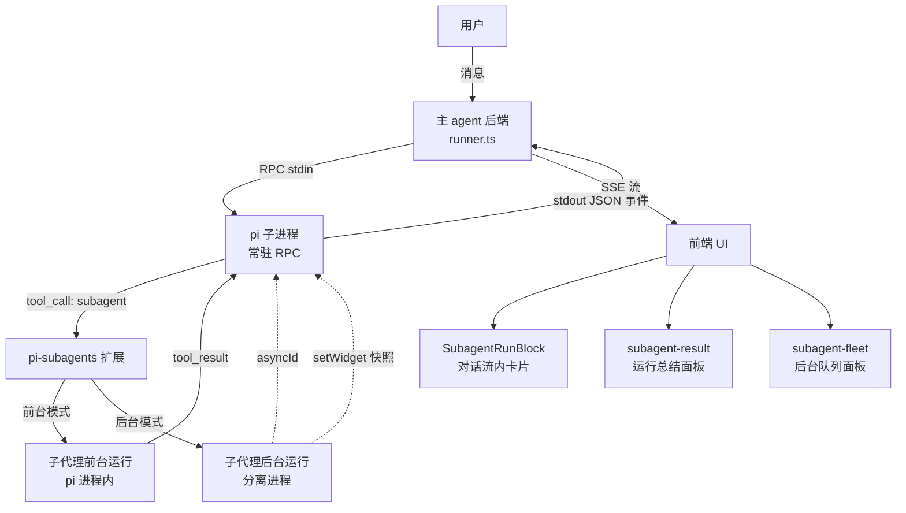

# pi-subagents 子代理接入逻辑分析

基于 commit `72126c6` 的代码阅读，回答两个核心问题。

---

## 问题一：主 agent 是否阻塞等待所有子代理运行返回？

### 结论：**是的，主 agent 会阻塞等待当前轮 settled**，但子代理有「前台」和「后台」两种运行模式。

### 详细分析

#### 主 agent 运行循环的阻塞机制

主 agent 的执行核心在 [`runner.ts`](file:///f:/Github/EchoesForgeClaw/backend-ts/src/services/pi/runner.ts) 的 `streamRound()` 函数。关键代码在 [L310-L348](file:///f:/Github/EchoesForgeClaw/backend-ts/src/services/pi/runner.ts#L310-L348)：

```typescript
// 出队循环：队列空且（agent_settled 已到 或 子进程已退出）时结束。
const isFinal = (): boolean =>
  round.settled ||
  timedOut ||
  round.emittedError ||
  round.aborted ||
  round.writeFailed ||
  (entry.closed && entry.stdoutEnded);

while (true) {
  if (round.queue.length) { yield round.queue.shift()!; continue; }
  if (isFinal() && !finalized) { /* 收尾 */ break; }
  await new Promise<void>((resolve) => { round.notify = resolve; });
}
```

主 agent 会一直循环消费事件队列，直到收到 `agent_settled` 事件（表示 pi 子进程本轮处理完成）才退出。**这是一个阻塞循环**——通过 `Promise` 等待新事件到来。

#### 子代理的两种运行模式

pi-subagents 扩展包支持两种模式：

| 模式 | 判定条件 | 主 agent 行为 |
|------|---------|-------------|
| **前台（sync）** | `args.async` 未设置或为 false | pi 进程等子代理完成后才 `tool_result`，再触发 `agent_settled`。**主 agent 整轮阻塞**。 |
| **后台（async）** | `args.async === true` 或结果包含 `asyncId` | pi 进程立即返回 `tool_result`（仅含 asyncId），子代理**分离为独立 runner 进程**继续运行。主 agent 不等后台子代理。 |

证据在 [`result.ts`](file:///f:/Github/EchoesForgeClaw/backend-ts/src/services/pi/subagents/result.ts#L83-L86)：
```typescript
// 后台运行判定：显式 background 或 asyncId 存在
const asyncId = typeof details.asyncId === 'string' && details.asyncId ? details.asyncId : undefined;
const background = details.background === true || asyncId !== undefined;
```

以及 [`cleanup.ts`](file:///f:/Github/EchoesForgeClaw/backend-ts/src/services/pi/subagents/cleanup.ts#L1-L11) 的注释明确说明：
> 后台（async）子代理是**分离 runner 进程**：父 RPC 进程被 kill 后可能残留，继续消耗服务器资源。

#### v1 版本特意关闭了 `wait` 工具

在 [`runner.ts`](file:///f:/Github/EchoesForgeClaw/backend-ts/src/services/pi/runner.ts#L160-L161) spawn 子进程时：
```typescript
// v1 关闭 wait 工具（其轮询/订阅增加后台驻留面；subagent_wait 不作为默认能力）
PI_SUBAGENT_WAIT_TOOL_ENABLED: 'false',
```

这意味着 **v1 版本中主 agent 不能通过 `wait` 工具去等后台子代理的结果**。后台子代理启动后就是「发射后不管」(fire-and-forget) 的语义。

#### 超时兜底

整轮有 [`RPC_AGENT_TIMEOUT_MS`](file:///f:/Github/EchoesForgeClaw/backend-ts/src/services/pi/config.ts#L39)（默认 10 分钟）的超时保护。如果子代理运行导致 pi 进程长时间不 settled，主 agent 会超时强制终止。

### 小结

```
用户消息 → pi 进程收到 prompt → pi 调 subagent 工具
                                    ├─ 前台: pi 等子代理完成 → tool_result → agent_settled → 主 agent 继续
                                    └─ 后台: pi 立即返回 asyncId → agent_settled → 主 agent 继续
                                             └─ 子代理在分离进程中继续运行（无回调通知主 agent）
```

---

## 问题二：子代理是否调用 `ask-user-question`、`todo` 等扩展工具？UI 怎么处理？

### 结论：**子代理工具调用在 pi 子进程内部完成，不直接暴露交互 UI 给用户；但后台运行状态快照会通过 `setWidget` 通道推送到 UI 面板。**

### 详细分析

#### 子代理可用的工具

子代理是 pi-subagents 扩展包自行管理的：它们运行在扩展包内部、使用扩展包提供的工具集。从 commit 的上下文来看：

1. **`todo` 工具**：是独立的 rpiv-todo 扩展包注册的工具。子代理**是否**能调用它取决于 pi-subagents 扩展的内部配置（子代理运行时是否挂载了 rpiv-todo）。在本项目侧，`todo` 的 widget 生产者已注册（[pi-widgets.ts L175](file:///f:/Github/EchoesForgeClaw/backend-ts/src/services/pi-widgets.ts#L175)），但只消费**主 agent** 流中的 `tool_call`/`tool_result` 事件。

2. **`ask-user-question` / dialog 工具**：主 agent 通过 RPC dialog 桥接支持交互（[events.ts L84-L115](file:///f:/Github/EchoesForgeClaw/backend-ts/src/services/pi/events.ts#L84-L115)），但 **dialog 方法白名单** 限于 `select`, `confirm`, `input`, `editor`：

   ```typescript
   const DIALOG_METHODS: ReadonlySet<string> = new Set(['select', 'confirm', 'input', 'editor']);
   ```
   
   **子代理的工具调用/结果**是在 pi 进程内部流转的——它们产生的 `tool_execution_start`/`tool_execution_end` 事件会被主 agent 的 `consumeLine()` 消费并映射为 `tool_call`/`tool_result` 事件推送到前端流，但子代理内部的交互 dialog **不太可能**回到前端（除非 pi-subagents 扩展显式通过 `setWidget`/`extension_ui_request` 上报）。

3. **工具黑名单** ([config.ts L33-L36](file:///f:/Github/EchoesForgeClaw/backend-ts/src/services/pi/config.ts#L33-L36))：通过 `PI_DISABLED_TOOLS` 环境变量全局排除危险工具（如 `bash`, `write` 等），但这只控制主 pi 进程，子代理的工具受限于 pi-subagents 扩展自身的 spawn 配置。

#### UI 如何处理子代理相关事件

UI 有**三个层次**的子代理展示：

##### 1. 对话流内 SubagentRunBlock（工具调用/结果卡片）

前端 [`SubagentRunBlock`](file:///f:/Github/EchoesForgeClaw/frontend/src/modules/bookplate/components/SubagentRunBlock.tsx) 通过 [`parseSubagentRuns()`](file:///f:/Github/EchoesForgeClaw/frontend/src/modules/bookplate/utils/subagentParser.ts) 从 `agentSteps` 中提取 `subagent` 工具的调用/结果，渲染为可折叠的卡片。

卡片显示内容：
- 子代理名称、状态（运行中/完成/失败）
- 后台运行标记（`asyncId`）
- Token 用量
- 结果文本摘要

这在 [`ChatNode.tsx`](file:///f:/Github/EchoesForgeClaw/frontend/src/modules/bookplate/components/ChatNode.tsx) 中挂载，位于 AI 文本输出下方、交互问答上方：

```tsx
{subagentRuns.length > 0 && (
  <div className="w-full mt-1.5 space-y-1.5">
    {subagentRuns.map((run, idx) => (
      <SubagentRunBlock key={run.toolCallId} run={run} defaultExpanded={idx === subagentRuns.length - 1} />
    ))}
  </div>
)}
```

##### 2. Extension Widget 运行总结面板（`subagent-result`）

[`subagentWidgetProducer`](file:///f:/Github/EchoesForgeClaw/backend-ts/src/services/pi/subagents/result.ts#L78) 在 `subagent` 工具的 `tool_result` 事件到达时，生产一个 `aboveEditor` 位置的 widget 面板，显示运行总结：
- 前台完成：逐行罗列子代理结果
- 后台启动：显示 "后台运行已启动 · asyncId"

##### 3. Extension Widget 后台队列面板（`subagent-fleet`）

[`events.ts`](file:///f:/Github/EchoesForgeClaw/backend-ts/src/services/pi/events.ts#L91-L93) 为 pi-subagents 的 `setWidget("subagent-async")` 开了一个**窄缝**：

```typescript
if (method === 'setWidget') {
  const runs = subagentFleetRunsFromUiRequest(evt);
  if (runs.length > 0) yield { type: 'subagent_fleet', runs };
}
```

扩展在 RPC 模式下通过 `setWidget` 把后台运行的状态快照（`PI_SUBAGENT_ASYNC_JSON:` 前缀行）推送上来。服务端 [`snapshot.ts`](file:///f:/Github/EchoesForgeClaw/backend-ts/src/services/pi/subagents/snapshot.ts) 做安全投影后，[`withWidgetBridge`](file:///f:/Github/EchoesForgeClaw/backend-ts/src/services/pi-widgets.ts#L323-L353) 将其渲染为 `belowEditor` 位置的 fleet 队列面板，实时显示各后台子代理的状态图标和当前工具活动。

> [!IMPORTANT]
> **关键设计**：除了 `subagent-async` 这一个 key，其他所有 `setWidget`、`notify`、`setStatus` 等扩展 UI 请求都被静默忽略。子代理内部的交互 dialog（如 ask-user-question）**不会**穿透到用户 UI。

#### 会话清理

[`cleanup.ts`](file:///f:/Github/EchoesForgeClaw/backend-ts/src/services/pi/subagents/cleanup.ts#L45-L77) 在「清空对话」时负责清理残留的后台子代理进程：
- 读取 `status.json` 中记录的 runner pid
- 终止进程（POSIX `SIGKILL` / Windows `taskkill /T /F`）
- 删除 temp 根目录

---

## 架构总结



### 关键行为汇总

| 方面 | 行为 |
|------|------|
| 前台子代理 | 主 agent **阻塞等待**，直到 pi 进程 `agent_settled` |
| 后台子代理 | 主 agent **不等待**，收到 asyncId 即继续 |
| `wait` 工具 | v1 **已关闭**（`PI_SUBAGENT_WAIT_TOOL_ENABLED=false`） |
| 超时保护 | 默认 10 分钟（`RPC_AGENT_TIMEOUT_MS`） |
| 子代理的 dialog/ask-user | **不穿透**到用户 UI（被 events.ts 静默忽略） |
| 子代理的 `todo` | 子代理内部工具，不走主 agent 的 widget 桥 |
| `setWidget` 通道 | 仅 `subagent-async` key 被窄缝放行，其余忽略 |
| 残留清理 | 清空对话时终止后台子代理进程 + 删除 temp 目录 |
