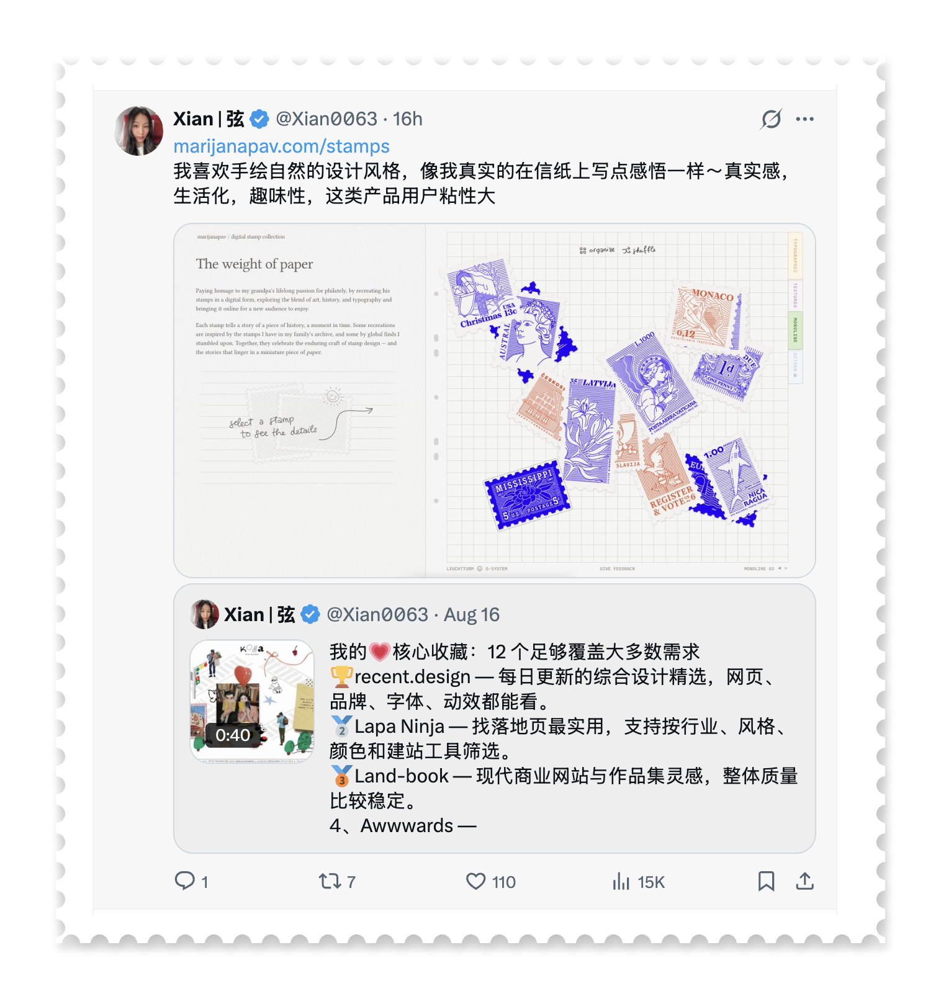
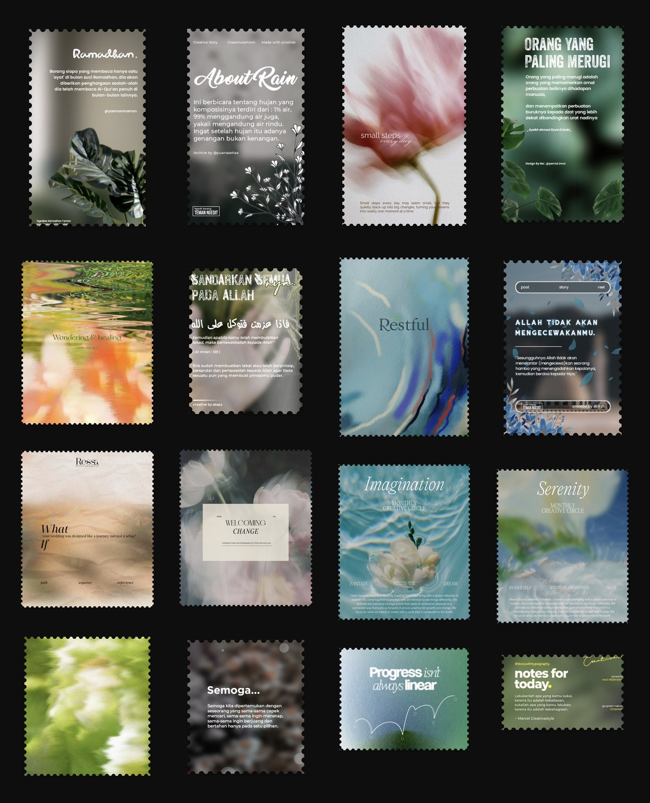

# stamp-edge

把任意图片处理成邮票风格的 Agent Skill:四周半圆打孔锯齿边 + 柔和投影,**默认无白边、输出真透明背景 PNG**(锯齿孔洞与四周 alpha=0),可直接叠加到任意背景上当贴纸/素材使用;可选加白色纸边。还能把多张邮票一键拼成等宽列瀑布流合集图(stamp sheet)。



## 用法

```bash
pip install Pillow

# 无白边 + 透明背景(默认)
python3 stamp_effect.py <输入图> <输出图.png>

# 加白色纸边
python3 stamp_effect.py <输入图> <输出图.png> margin

# 浅灰白底成品图(可与 margin 组合)
python3 stamp_effect.py <输入图> <输出图.png> bg
```

## 拼合集图

多张邮票生成后,用 `stamp_sheet.py` 拼成一张合集:等宽列瀑布流,每张邮票撑满列宽、无留白,列高自动贪心均衡。

```bash
python3 stamp_sheet.py sheet.png *_stamp.png                      # 默认 4 列深色底
python3 stamp_sheet.py sheet.png --cols 3 --bg "#f5f2ea" -- *_stamp.png
```



## 作为 Skill 安装

把整个目录放到你的 Agent skills 目录(如 `~/.agents/skills/stamp-edge/`),之后对 Agent 说"把这张图做成邮票边"即可触发。

## 可调参数(脚本顶部)

| 参数 | 默认值 | 说明 |
|------|--------|------|
| `margin` | 0(传 `margin` 选项时 46) | 内容到锯齿边的白边宽度 |
| `hole_r` | 14 | 打孔半圆半径 |
| `pitch` | 46 | 打孔间距 |
| `outer_pad` | 90 | 邮票外留白(投影空间) |
| `shadow_alpha` | 70 | 投影不透明度 |

## 注意

- 微信等平台直接发图会把透明 PNG 压成 JPG 导致透明丢失,需保透明请以文件形式发送
