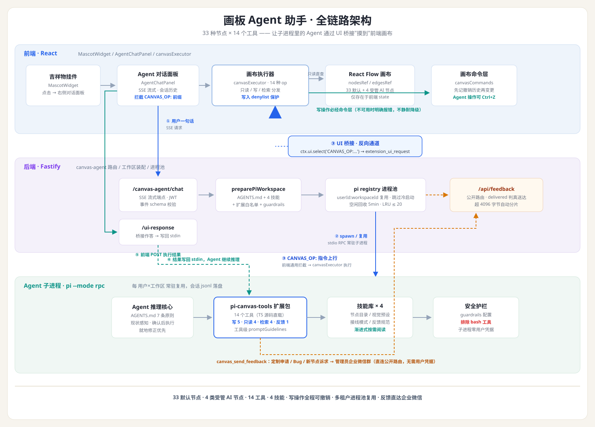

# 我们给画布上的吉祥物装了一个大脑：画板 Agent 助手是如何炼成的

> 它不是装饰。它看得懂你的画布，动得了你的节点，还能把你的需求原样捎到开发者的企业微信群里。

---

## 从「吉祥物」到「助手」

我们的画板产品里有 38 种节点——从图书元数据、天气查询，到水彩晕染、玻璃折射、杂志排版，用户像搭积木一样把它们连成自己的创作流水线。

但新用户的第一句话往往是：**"这么多节点，我该用哪个？"**

于是我们做了一个决定：把左下角那个吉祥物挂件，从装饰变成入口。点击 Agent 按钮，右侧滑出对话面板，你用中文说出想法——

- "帮我做一张图书推荐卡片"
- "把上传的图片变成水墨画风格"
- "我想申请定制一个写七言绝句的大模型节点"

它听懂，然后在你的画布上**真的动手**。

---

## 一句话背后的完整链路

你说出"查一下今天北京的天气"，到画布上多出一个填好城市名的天气节点，中间发生了什么？

```
吉祥物挂件 → Agent 对话面板 → SSE 流式对话
  → 后端装配专属工作区（系统提示词 + 4 个技能 + 工具扩展包 + 安全护栏）
  → pi-agent RPC 常驻子进程开始推理
    → 调用 canvas_create_node 工具
      → 操作指令经 stdout 发出（extension_ui_request）
        → 前端识别 CANVAS_OP: 前缀，静默执行真实画布变更
          → 执行结果原路写回子进程，Agent 拿到回执继续思考
  → 事件流归一 → SSE → 你看着节点在画布上"长"出来
```



这条链路里藏着我们最得意的一个设计。

---

## 核心设计：让子进程里的 Agent "摸到" 前端的画布

**这是整个功能最有传播力的技术点，值得展开讲。**

画布的节点数据只存在于前端 React state 里，不落盘、不在 Agent 的工作区文件系统里。Agent 的推理发生在一个独立 RPC 子进程中——按常规思路，它**永远无法**读到你的画布，更别说动手改。

我们的解法是一条**反向通道**：

1. 扩展工具把画布操作编码成 `ctx.ui.select('CANVAS_OP:create_node', [参数])`——借 pi-agent 原生的 UI 交互事件外发；
2. 前端对话面板看到 `CANVAS_OP:` 前缀，**不弹窗、静默拦截**，直接调用画布执行器完成建节点/连线/改参/删除；
3. 执行结果经既有 ui-response 通道写回子进程 stdin，工具拿到结构化回执，Agent 的推理继续。

这个设计的妙处在于**扩展性**：新增一个画布工具 = 扩展端一个 `canvasOp()` 调用 + 前端一个 switch case，两端各一处，传输层零改动。我们从 5 个工具迭代到 14 个工具，桥接协议一个字没改。

---

## 14 个工具：能建、能看、能改、能删、能搜、能反馈

| 类别 | 工具 | 能力 |
|---|---|---|
| 写操作 | create / connect / update / disconnect / delete | 建节点、连线、就地改参、断线、删节点 |
| 只读感知 | list_nodes / read_node_output / get_node_details / get_node_params | 看画布现状、读节点产出、查字段、查参数默认值 |
| 检索 | search_prompts / search_skills / get_presets / get_node_configs | 搜提示词库、搜技能库、查视觉预设 |
| 反馈 | send_feedback | 工单直达管理员企业微信 |

几个值得说的细节：

**只读工具的上下文经济学。** `canvas_list_nodes` 只返回节点清单（id/类型/标题/坐标），不返回正文——它是"目录"；要看正文再用 `canvas_read_node_output`，超 20000 字符截断并明确标注，base64 图片收敛成"mime + 长度"占位符。**每一个 token 都花在刀刃上。**

**Agent 动的手，你都能撤销。** 我们发现过一个隐蔽问题：Agent 建的节点 Ctrl+Z 撤销不了，而手动建的可以——因为 Agent 的执行器绕过了画布自己的撤销栈。修复方式是把所有写操作收敛到统一的命令层，先记撤销历史再改状态。现在 **Agent 的每一次建、改、删、断线，都和你的手动操作享受同等的 Ctrl+Z 待遇**。

**删除必确认，失败必报错。** 删节点是两段式：先返回影响范围（节点名、下游子孙清单、受影响连线数），弹确认框，用户点头才真正执行——即使只删一个节点也弹。画布页没打开时，Agent 对画布下指令会收到明确报错，而不是静默改坏。

---

## 安全：我们给 Agent 的约束比对用户更严

一个能自主操作你画布的 AI，值得被认真约束：

- **能力最小化**：画板助手只禁用了一个工具——bash。原因很具体：shell 是安全护栏的唯一绕过面（shell 变量展开的路径无法还原，可能读到模型配置里的 API Key）。禁掉它，风险面直接消失。
- **写入 denylist**：`isGenerating`、`error`、`output`、`imageUrl` 这些字段只允许由节点运行产生——**Agent 无法凭空伪造一张生成结果图**。
- **受管节点不走后门**：图像分析、图像生成、文本生成、AI 对话这 4 类节点需要后台绑定模型与提示词，普通用户不能空白创建，Agent 也改不了它们的配置 ID——它只会帮你把需求整理成工单，走正门提交。
- **子进程零凭据**：检索类工具不直接调需要登录的后端接口，而是走桥接由前端带着用户自己的凭据代调。不扩鉴权面，不造万能钥匙。

---

## "工具装上了" ≠ "模型会用"

这是我们踩过最值钱的坑。

第一版助手上线后我们发现：工具明明注册成功了，模型却经常不主动用。原因是**模型不知道什么时候该用、在哪个环节用、和其他工具怎么配合**。

解法是三层同步：

1. **系统提示词**写"什么时候该用"——比如"判断需求前，先看画布现状，而不是假设画布是空的"；
2. **技能文档**写"在哪个流程环节用"——比如"连线前先确认上游节点真的有输出，没有就如实告知，不要编造"；
3. **工具自带的 promptGuidelines** 写"和其他工具的协作关系"——比如"创建前先用 list 看现状，能改就别新建"。

三层一起改，行为才稳定。配套的 4 个渐进式加载技能（33 节点速查表、多模态预设字典、接线模式库、反馈规范）遵循 progressive disclosure：系统提示词里只放名称与摘要，Agent 按需调阅，上下文窗口不被知识库撑爆。

---

## 一个诚实的细节：反馈通道的"假成功"

这个功能我们迭代了五轮，每轮都把踩的坑沉淀成维护手册。最典型的一个：

企业微信群机器人的 webhook **无论消息是否被接受，HTTP 状态码永远返回 200**。真实成败藏在响应体的 `errcode` 里。我们早期只判断 `resp.ok`，于是"机器人被移出群"这种失败被记成了"推送成功"——用户以为需求送到了，其实石沉大海。

修复后：回执以 `delivered` 字段为准；正文超 4096 字节自动分成多条消息（不截断、不丢内容）；未送达时，提示词明确要求 Agent **"如实告知用户未送达，不得声称已推送"**。

我们相信：一个会撒谎讨好的助手，不如一个会报告坏消息的助手。

---

## 多租户的工程底座

画板助手跑在一个经过实战打磨的多租户 RPC 体系上：

- **进程复用**：每个用户×工作区的 Agent 子进程常驻复用，同一配置代数直接向存活进程发消息，跳过冷启动；
- **资源纪律**：5 分钟空闲回收，全局并发上限 20 个，超限按 LRU 驱逐——但绝不杀正在干活的进程；
- **故障可观察**：装配期诊断（技能缺失、扩展装配失败、模型配置退化）都会以状态事件透传给用户，不搞"悄悄少能力"。

---

## 写在最后

这个功能从设计文档到落地，最大的启发是：**AI 助手的价值不在于它多能说，而在于它真的能动手，并且每一下都动得让人放心。**

看得懂画布（只读感知）、动得了节点（可撤销写操作）、守得住边界（denylist + 护栏 + 确认机制）、传得了话（需求直达开发者微信群）。

吉祥物还是那个吉祥物。只是现在，它有大脑了。

---

*技术栈：React + React Flow / Fastify + TypeScript / pi-agent RPC 子进程体系 / 企业微信 Webhook。*

*本文所有工程细节均来自真实代码与维护手册，无一行虚构。*
