# 中国传统配色

简体中文 | [English](README.md) | [日本語](README.ja.md)

如果你在做设计、写内容、做课件、搭建网页主题，常常需要一套稳妥、好看、能直接落版的中国色参考，这个仓库就是为这件事整理的。

这里收录 742 张中华传统色高清色卡，已按原始 742 色清单完整覆盖。每张色卡包含色名、HEX、RGB、CMYK、配色推荐和气质关键词。现在它不只是素材库，也是一套可交互的中国色工作台：可以查色、试场景、生成色板、浏览配色关系、查看渐变逻辑、制作用途卡片、生成 shadcn 主题、配置终端调色板，并把喜欢的色卡和整组方案收藏到本机。

## 快速入口

- [在线浏览色卡](https://colors.xiaoxiaodong.ai/)
- [场景试色工作台](https://colors.xiaoxiaodong.ai/style-lab.html)
- [中国色配色生成](https://colors.xiaoxiaodong.ai/generator.html)
- [中国色生成 shadcn 主题](https://colors.xiaoxiaodong.ai/theme-forge.html)
- [中国色终端配色方案](https://colors.xiaoxiaodong.ai/terminal.html)
- [中国色配色灵感](https://colors.xiaoxiaodong.ai/palettes.html)
- [渐变逻辑卡片](https://colors.xiaoxiaodong.ai/gradients.html)
- [用途卡片](https://colors.xiaoxiaodong.ai/uses.html)
- [本机收藏面板](https://colors.xiaoxiaodong.ai/favorites.html)
- [中国传统色 Studio Skills](https://colors.xiaoxiaodong.ai/skills.html)
- [直接下载完整 ZIP](https://github.com/nevertoday/zhongguo-traditional-colors/releases/latest/download/zhongguo-traditional-colors-images.zip)
- [查看 Release](https://github.com/nevertoday/zhongguo-traditional-colors/releases/tag/v0.1.0)
- [原始 742 色清单](docs/chinese-color-master-list.md)
- [742 色配色方案 Markdown](docs/chinese-color-harmony.md)
- [742 色配色关系 CSV](docs/chinese-color-harmony.csv)
- [中国传统色实战 Skills](#中国传统色实战-skills)
- [作者 X 主页](https://x.com/xiaoxiaodong01)

## 这个项目能帮你什么

| 你需要 | 这里提供 |
| --- | --- |
| 快速找中国色参考 | 742 张高清 PNG 色卡 |
| 做设计和内容配图 | 可直接预览、复制、下载、收藏单张色卡 |
| 搭建色彩资料库 | 文件名与 742 色清单一一对应 |
| 做网页、PPT、封面、海报、品牌板 | 场景试色会把主色拆成背景、标题、正文、按钮和点缀角色 |
| 快速产出一组可用 palette | 配色生成支持锁定、替换、轮换、复制、导出和收藏 |
| 生成可直接接入的 UI 主题 | 主题生成把锚色映射成整套 shadcn 语义主题，含日间/夜间与 OKLCH，预览组件并导出 globals.css |
| 配置终端调色板 | 终端配色生成 16 色 ANSI + 背景/前景/光标/选区，过 WCAG 对比度，一键复制 Ghostty / Alacritty / kitty 配置 |
| 找配色关系和灵感 | 按同类、邻近、互补、三角、冷暖、明暗、灰调等关系浏览 8,904 组配色 |
| 理解单色渐变逻辑 | 每个传统色生成浅阶、本色、邻近、深阶、双色切片和渐变路径 |
| 做背景/文字/按钮用途卡 | 用途卡片会检查对比度，并支持复制、换相近和收藏整组双色方案 |
| 留住喜欢的方案 | 收藏面板集中查看色卡、配色、用途卡片、生成方案和场景试色 |
| 校对色名和色值 | 色名、HEX、RGB、CMYK 集中整理 |
| 把传统色真正用进项目 | 10 个面向设计实战的 Agent Skills |

原图约 998 MB。ZIP 文件作为 GitHub Release 附件提供，不直接提交进仓库。

## 功能截图导览

### [浏览色卡](https://colors.xiaoxiaodong.ai/#gallery)

<p align="center">
  <a href="https://colors.xiaoxiaodong.ai/#gallery"></a>
</p>

按编号、色名、HEX 或色相快速筛选 742 张色卡；每张卡都能预览细节、复制色值、下载原图和加入收藏。

### [场景试色](https://colors.xiaoxiaodong.ai/style-lab.html)

<p align="center">
  <a href="https://colors.xiaoxiaodong.ai/style-lab.html"></a>
</p>

选择一个传统色后，直接查看它在网页、PPT、封面、海报和品牌板里的背景、标题、正文、按钮和点缀落位。

### [配色生成](https://colors.xiaoxiaodong.ai/generator.html)

<p align="center">
  <a href="https://colors.xiaoxiaodong.ai/generator.html"></a>
</p>

从锚点色或生成方式出发生成五色方案，支持锁定、替换、轮换、反转、复制整组、收藏和导出。

### [配色灵感](https://colors.xiaoxiaodong.ai/palettes.html)

<p align="center">
  <a href="https://colors.xiaoxiaodong.ai/palettes.html"></a>
</p>

按同类、邻近、互补、三角、冷暖、明暗、灰调和中性等关系浏览 8,904 组配色，并可复制、收藏、随机换组。

### [用途卡片](https://colors.xiaoxiaodong.ai/uses.html)

<p align="center">
  <a href="https://colors.xiaoxiaodong.ai/uses.html"></a>
</p>

把传统色组合成背景与文字双色卡片，提供字号/版式预览、对比度判断、搜索第二色、复制、换相近和收藏。

### [收藏](https://colors.xiaoxiaodong.ai/favorites.html)

<p align="center">
  <a href="https://colors.xiaoxiaodong.ai/favorites.html"></a>
</p>

集中查看本机保存的色卡、配色、用途卡片、生成方案和场景试色；支持按类型筛选、复制、打开和移除。

### [Studio Skills](https://colors.xiaoxiaodong.ai/skills.html)

<p align="center">
  <a href="https://colors.xiaoxiaodong.ai/skills.html"></a>
</p>

把 742 色清单和配色关系变成实战工作流：定方向、组色板、放版面、交 token、查可读、定品牌、做图表、修旧稿、做系列和进生产。

## 中国传统色实战 Skills

这些 skill 不是继续解释色彩理论，而是把 742 色清单和配色关系 CSV 转成设计师能直接使用的工作流。每个 skill 都对应一个真实工作阻塞点：方向太虚、色板太多、落位困难、Token 交付、可读性、品牌治理、图表编码、旧稿迁移、系列内容和印刷生产。

每个 `xxd-*` skill 目录都随包包含完整 `references/chinese-color-master-list.md`、`references/chinese-color-harmony.md` 和 `references/chinese-color-harmony.csv`，单独取用某个 skill 时也能访问完整 742 色清单和每个颜色的配色关系。

### 安装到 Claude Code

每个 `xxd-*` 都是 Claude Code 原生 skill（带 frontmatter 的 `SKILL.md`），可以直接装进你的 Claude Code：

```bash
# 克隆仓库后，把需要的 skill 复制到个人 skills 目录
git clone https://github.com/nevertoday/zhongguo-traditional-colors.git
cp -r zhongguo-traditional-colors/skills/xxd-palette-builder ~/.claude/skills/
# 想全部装上：
cp -r zhongguo-traditional-colors/skills/xxd-* ~/.claude/skills/
```

每个 skill 自带完整 `references/`，复制后即可独立运行，无需联网取数据。装好后在 Claude Code 里直接描述任务（例如“用朱砂做一套 UI token”），或显式调用对应 skill 即可触发。

| Skill | 适合解决的问题 |
| --- | --- |
| [`xxd-color-brief`](skills/xxd-color-brief/SKILL.md) | 把“高级、东方、年轻、克制”这类模糊方向翻译成冷暖、明度、饱和度、对比和避坑约束 |
| [`xxd-palette-builder`](skills/xxd-palette-builder/SKILL.md) | 从锚点色、HEX、情绪或场景中筛出少量可执行 palette，并分配主辅点缀和比例 |
| [`xxd-palette-applier`](skills/xxd-palette-applier/SKILL.md) | 把一组颜色落到真实版面，决定背景、标题、正文、CTA、结构和装饰的位置 |
| [`xxd-ui-token`](skills/xxd-ui-token/SKILL.md) | 把传统色变成 primitive、semantic、component、mode 四层 UI token 和代码输出 |
| [`xxd-accessible-color`](skills/xxd-accessible-color/SKILL.md) | 用 WCAG ratio 检查文字、按钮、状态和图表，并用同库颜色修复失败组合 |
| [`xxd-brand-system`](skills/xxd-brand-system/SKILL.md) | 为长期品牌建立锚点色、支撑色、比例、渠道规则、禁用组合和治理边界 |
| [`xxd-data-viz`](skills/xxd-data-viz/SKILL.md) | 按分类、顺序、发散、高亮或语义状态生成图表色，而不是套海报色板 |
| [`xxd-existing-design-audit`](skills/xxd-existing-design-audit/SKILL.md) | 盘点旧稿、CSS、Figma styles 或 HEX 清单，判断保留、合并、替换或移除 |
| [`xxd-content-series`](skills/xxd-content-series/SKILL.md) | 为小红书、公众号、视频、课程和栏目建立固定层、变量层、模板层和轮换规则 |
| [`xxd-print-packaging`](skills/xxd-print-packaging/SKILL.md) | 面向包装、书籍、文创、标签和实体材质规划用色，并提示 CMYK、材质和打样风险 |

### 怎么选择这些 Skills

如果你还没有确定方向，先用 `xxd-color-brief`。如果已经有一个主色或一组候选色，用 `xxd-palette-builder` 收敛成色板，再用 `xxd-palette-applier` 放到真实版面。要交给开发、团队或生产环节时，再进入 `xxd-ui-token`、`xxd-brand-system`、`xxd-data-viz` 或 `xxd-print-packaging`。如果你手上是旧稿、旧 CSS 或散乱 HEX，先用 `xxd-existing-design-audit` 做盘点。长期内容矩阵则从 `xxd-content-series` 开始。

下面是每个 skill 的详细使用方案。每一项都按“它帮谁、解决什么、你要输入什么、会得到什么、怎么触发”来写，方便直接复制到自己的项目里改。

<details>
<summary><strong><code>xxd-color-brief</code>：把模糊审美词变成配色方向</strong></summary>

**利他价值**：帮客户、设计师和执行者先对齐判断语言，减少“我觉得不高级”“这个不够东方”这类主观拉扯。

**适合谁用**：项目刚启动的设计师、品牌负责人、内容团队、课程或活动视觉负责人。

**典型场景**：只有 moodboard、参考图、品牌关键词或客户口头反馈，还不适合直接选色。

**输入什么**：项目载体、目标人群、希望传递的气质、必须避开的感觉、已有参考图或竞品。

**得到什么**：冷暖、明度、饱和度、对比强度、风险边界、3 到 5 个起始传统色，以及下一步推荐使用的 skill。

**使用方式**：先让它输出方向简报，再把简报里的锚点色交给 `xxd-palette-builder` 生成具体色板。

示例触发：

<pre><code>/xxd-color-brief 为新中式茶饮品牌做年轻但不俗的配色方向，受众是 20-35 岁女性，避免廉价国潮感</code></pre>

[查看完整 Skill](skills/xxd-color-brief/SKILL.md)

</details>

<details>
<summary><strong><code>xxd-palette-builder</code>：从 742 色里筛出可执行色板</strong></summary>

**利他价值**：把选择困难变成少量可比较方案，让团队不用在几百个颜色里反复试错。

**适合谁用**：已经有锚点色、品牌关键词、HEX 清单、参考图或初步视觉方向的人。

**典型场景**：要做官网、封面、PPT、海报、包装或 UI，但不知道主色、辅色、点缀色怎么分配。

**输入什么**：锚点色或色名、用途、希望稳妥还是更有记忆点、浅色/深色偏好、禁用色或品牌限制。

**得到什么**：主色、辅色、背景色、强调色、推荐比例、替代方案、使用风险和可继续落版的色板。

**使用方式**：先选一个方向最明确的锚点色；如果没有锚点色，先用 `xxd-color-brief`。拿到色板后，用 `xxd-palette-applier` 判断具体放在哪里。

示例触发：

<pre><code>/xxd-palette-builder 以月白为锚点，为文化类网站首页生成主辅点缀色板，要求安静、有层次、适合长文阅读</code></pre>

[查看完整 Skill](skills/xxd-palette-builder/SKILL.md)

</details>

<details>
<summary><strong><code>xxd-palette-applier</code>：把色板放进真实版面</strong></summary>

**利他价值**：让颜色服务信息层级和阅读路径，而不是让所有颜色同时争抢注意力。

**适合谁用**：已经有色板，但不知道背景、标题、正文、按钮、边框、装饰分别用什么颜色的人。

**典型场景**：网页首屏、PPT 封面、课程详情页、文章长图、包装正反面或社媒模板。

**输入什么**：已有色板、页面结构、主要信息层级、用户最应该先看到什么、哪些区域需要克制。

**得到什么**：背景/内容/行动/结构/细节五类角色、面积比例、版面落点、错误用法和替代建议。

**使用方式**：先把色板中的每个颜色分配角色，再按面积比例落版；如果最后要交给开发，继续用 `xxd-ui-token`。

示例触发：

<pre><code>/xxd-palette-applier 把月白、黛蓝、绛紫、银朱这组传统色用到课程封面和详情页首屏，重点突出报名按钮</code></pre>

[查看完整 Skill](skills/xxd-palette-applier/SKILL.md)

</details>

<details>
<summary><strong><code>xxd-ui-token</code>：把传统色变成开发能接的 UI Token</strong></summary>

**利他价值**：让设计、开发和后续维护共用同一套命名规则，减少硬编码、返工和深色模式混乱。

**适合谁用**：做网站、App、后台、工具、设计系统、Figma variables 或 Tailwind 主题的人。

**典型场景**：设计稿已经定色，但开发需要 CSS variables、Tailwind config、Figma token 或浅深色模式规则。

**输入什么**：产品类型、已有色板、组件类型、浅色/深色模式要求、输出格式、需要保留的品牌色。

**得到什么**：primitive、semantic、component、mode 四层 token，默认 CSS variables，也可以改成 Tailwind 或 Figma 结构。

**使用方式**：先让它建立 token 命名和角色，再给开发接入。上线前建议再用 `xxd-accessible-color` 检查关键文本和按钮。

示例触发：

<pre><code>/xxd-ui-token 把这组中国传统色转成官网浅色和暗色模式 CSS variables，包含按钮、边框、背景、文本和焦点态</code></pre>

[查看完整 Skill](skills/xxd-ui-token/SKILL.md)

</details>

<details>
<summary><strong><code>xxd-accessible-color</code>：检查传统色是否真的读得清</strong></summary>

**利他价值**：照顾真实阅读者和操作场景，让传统色的美感不牺牲清晰度、可读性和可访问性。

**适合谁用**：需要检查正文、按钮、图表、状态提示、标签、焦点态或深色模式的人。

**典型场景**：颜色看起来很雅致，但文字压上去变浅，按钮不够明显，图表系列很难区分。

**输入什么**：前景色、背景色、用途、字号、是否为正文/按钮/状态/图表、是否需要通过 WCAG 标准。

**得到什么**：contrast ratio、通过/条件可用/失败判断、同库替代色、非颜色提示建议和修复方案。

**使用方式**：在页面上线、交付开发、制作图表或印刷小字前使用。失败组合不要硬撑，优先换同库替代色。

示例触发：

<pre><code>/xxd-accessible-color 检查 #F9F4DC 背景上的 #5C2223 正文和按钮文字是否适合网页阅读，并给出同库替代色</code></pre>

[查看完整 Skill](skills/xxd-accessible-color/SKILL.md)

</details>

<details>
<summary><strong><code>xxd-brand-system</code>：把一次配色沉淀成长期品牌规则</strong></summary>

**利他价值**：让团队有长期决策依据，减少每次活动、海报、官网或包装都重新争论颜色。

**适合谁用**：品牌升级、产品官网、社媒矩阵、包装系列、内容栏目或长期视觉系统负责人。

**典型场景**：已经有一组不错的中国传统色，但还没有品牌锚点、使用比例、渠道规则和禁用组合。

**输入什么**：行业、价格带、目标用户、竞品差异、品牌性格、主要渠道、已有色板或必须保留的颜色。

**得到什么**：品牌锚点色、支撑色、强调色、默认比例、渠道差异、禁用组合和后续 token 化建议。

**使用方式**：先用它确定长期规则，再把规则交给内容、设计和开发团队。需要落地 UI 时接 `xxd-ui-token`。

示例触发：

<pre><code>/xxd-brand-system 为文创香氛品牌建立传统色规范，覆盖官网、包装、小红书封面和线下展陈</code></pre>

[查看完整 Skill](skills/xxd-brand-system/SKILL.md)

</details>

<details>
<summary><strong><code>xxd-data-viz</code>：按数据含义生成传统色图表方案</strong></summary>

**利他价值**：让读者先看懂数据，再感受到中国传统色气质；图表颜色首先要服务理解。

**适合谁用**：做仪表盘、报告图表、地图、热力图、数据故事、课程数据页或可视化组件的人。

**典型场景**：海报色板直接放进图表后，分类分不清、顺序没轻重、正负发散没有中点。

**输入什么**：图表类型、系列数量、背景色、数据是分类/顺序/发散/高亮/语义状态中的哪一种。

**得到什么**：分类色数组、顺序色带、发散色带、高亮色、状态色，以及 ECharts、D3、Chart.js 可用格式。

**使用方式**：先判断数据关系，再让 skill 出色彩编码。不要把装饰色当图表色，必要时用 `xxd-accessible-color` 检查区分度。

示例触发：

<pre><code>/xxd-data-viz 为 7 个分类和一个高亮系列生成 ECharts 中国传统色数组，背景是浅色，要求分类容易区分</code></pre>

[查看完整 Skill](skills/xxd-data-viz/SKILL.md)

</details>

<details>
<summary><strong><code>xxd-existing-design-audit</code>：把旧稿和散乱 HEX 迁移到传统色体系</strong></summary>

**利他价值**：尊重旧项目里已经有效的识别资产，只清理真正造成混乱、重复或难维护的颜色。

**适合谁用**：手上有旧官网、旧 CSS、Figma styles、历史海报、品牌色表或一串散乱 HEX 的团队。

**典型场景**：旧稿颜色很多，没人知道哪些该保留、哪些该合并、哪些只是临时色。

**输入什么**：HEX 清单、截图描述、颜色当前用途、不能轻易改的颜色、希望迁移到传统色的程度。

**得到什么**：颜色盘点、相近传统色映射、保留/合并/替换/移除建议、迁移风险和执行顺序。

**使用方式**：先做审计，不要一上来全量替换。确认保留色后，再用 `xxd-brand-system` 或 `xxd-ui-token` 沉淀规则。

示例触发：

<pre><code>/xxd-existing-design-audit 审计这组 CSS 颜色，映射到最接近的中国传统色，并告诉我哪些应该保留或合并</code></pre>

[查看完整 Skill](skills/xxd-existing-design-audit/SKILL.md)

</details>

<details>
<summary><strong><code>xxd-content-series</code>：为长期内容建立统一但不疲劳的色彩系统</strong></summary>

**利他价值**：帮内容团队稳定生产，既保留栏目识别度，也降低每期重新设计封面和模板的压力。

**适合谁用**：小红书、公众号、视频封面、课程课件、newsletter、栏目海报和长期内容矩阵。

**典型场景**：每期都重新配色会散，完全固定又容易腻，团队难以长期执行同一套视觉语言。

**输入什么**：平台、栏目数量、更新节奏、模板类型、固定元素、可变化元素和希望形成的内容气质。

**得到什么**：固定层、变量层、模板层、栏目色、特殊期色、轮换规则和内容生产检查清单。

**使用方式**：先把栏目分层，再决定哪些颜色长期固定、哪些颜色轮换。需要做成品牌规范时接 `xxd-brand-system`。

示例触发：

<pre><code>/xxd-content-series 为小红书 5 个栏目做统一但不重复的封面色彩系统，每周更新 3 次，要求传统但不老气</code></pre>

[查看完整 Skill](skills/xxd-content-series/SKILL.md)

</details>

<details>
<summary><strong><code>xxd-print-packaging</code>：把屏幕色推进到包装和印刷生产</strong></summary>

**利他价值**：提前照顾印刷、材质、供应商和最终实物效果，减少交付后才发现色差或小字不可读的成本。

**适合谁用**：包装、书籍、礼盒、文创、标签、实体材料、展陈和需要给印刷方沟通的项目。

**典型场景**：屏幕 HEX 看起来很好，但实际受 CMYK、纸张、油墨、覆膜、烫金、光线和材质影响很大。

**输入什么**：品类、材质、工艺、预算/价格带、系列数量、是否需要专色、小字和条码区域要求。

**得到什么**：正背侧面板用色、系列变体规则、CMYK 风险、材质建议、小字和条码提醒、打样检查清单。

**使用方式**：先用它做生产前风险排查，再与供应商确认打样。不要直接把屏幕 HEX 当最终印刷值。

示例触发：

<pre><code>/xxd-print-packaging 为茶叶礼盒规划传统色、系列变体和印刷打样清单，材质是哑粉纸加局部烫金</code></pre>

[查看完整 Skill](skills/xxd-print-packaging/SKILL.md)

</details>

## 精选色卡预览

README 只展示 24 张代表性色卡，避免页面过长。完整 742 张可以在 [在线色卡资料库](https://colors.xiaoxiaodong.ai/#gallery)、`images/` 目录或 Release ZIP 中查看和下载。

<!-- gallery:start -->
<p align="center">
  <a href="images/001-乳白.png">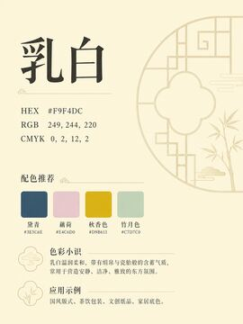</a>
  <a href="images/035-秋葵黄.png">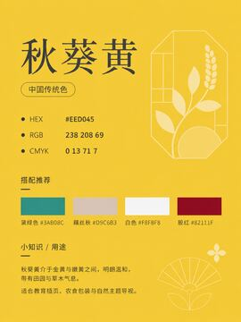</a>
  <a href="images/080-琥珀黄.png">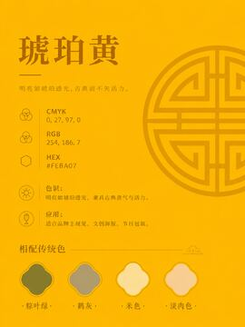</a>
  <a href="images/135-朱红.png">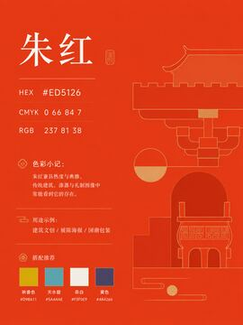</a>
</p>

<p align="center">
  <a href="images/188-芙蓉红.png">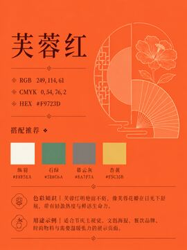</a>
  <a href="images/244-枣红.png">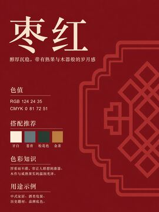</a>
  <a href="images/321-魏紫.png">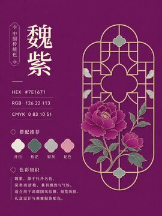</a>
  <a href="images/380-碧青.png">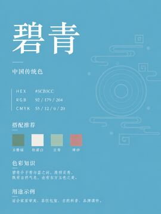</a>
</p>

<p align="center">
  <a href="images/424-月白.png"></a>
  <a href="images/443-翠蓝.png">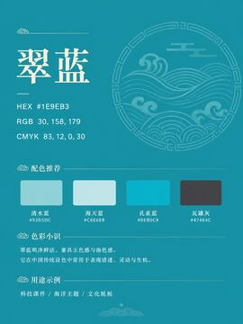</a>
  <a href="images/490-荷叶绿.png">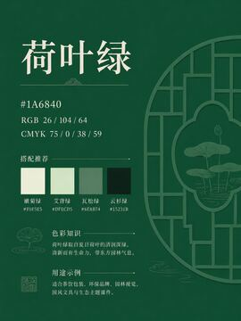</a>
  <a href="images/533-黛蓝.png">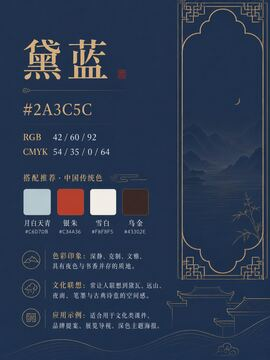</a>
</p>

<p align="center">
  <a href="images/580-松花.png">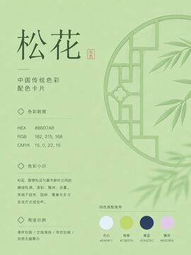</a>
  <a href="images/607-朱砂红.png">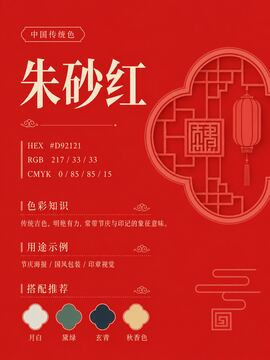</a>
  <a href="images/628-玄青.png">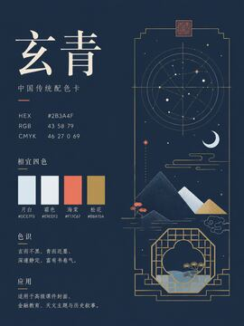</a>
  <a href="images/658-帝王紫.png">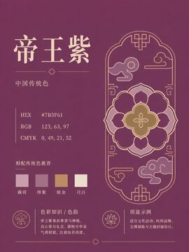</a>
</p>

<p align="center">
  <a href="images/677-浅紫藤萝.png">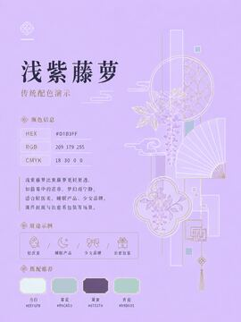</a>
  <a href="images/695-霁蓝.png">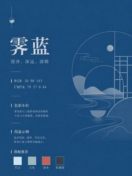</a>
  <a href="images/705-松花绿.png">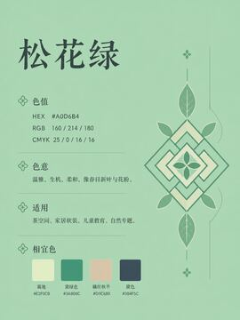</a>
  <a href="images/720-胭脂泪.png">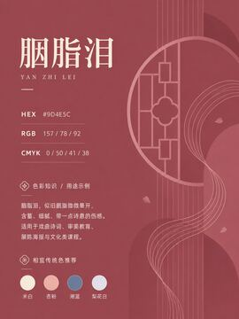</a>
</p>

<p align="center">
  <a href="images/729-汉绣绿.png">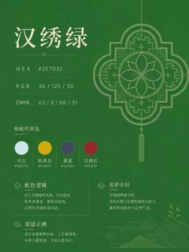</a>
  <a href="images/735-鎏金.png">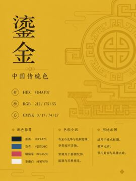</a>
  <a href="images/741-青黛.png">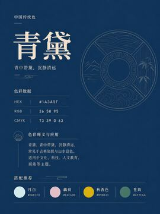</a>
  <a href="images/742-深绿.png">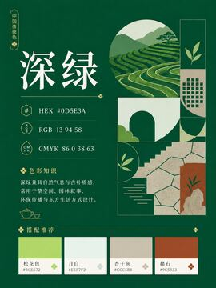</a>
</p>

<!-- gallery:end -->

## 为什么整理这个项目

中文世界里有很多传统色资料，但真正做东西时，经常还要自己到处找图、抄色值、对照色名、整理文件。这个项目把这些重复劳动提前做掉，让设计师、老师、内容创作者和开发者可以直接拿来参考、下载和二次整理。

中国传统色不只是一组漂亮色值，也连接着器物、织染、矿物颜料、诗词意象、节气物候和审美秩序。把它们做成一张张可浏览的色卡，会比单纯看表格更容易建立感觉，也更容易被更多人用起来。

## 适合谁用

- 设计师可以把它当作品牌配色、界面主题和视觉实验的参考板
- 内容创作者可以用它做封面、海报、长图和传统文化选题配图
- 老师和学生可以用它做色彩课程、美术教学、传统文化课件
- 前端开发者可以用它做主题页面、颜色工具、素材站和开放数据实验
- 对传统色感兴趣的人可以直接浏览，慢慢建立自己的色彩词汇

## Star History

[](https://www.star-history.com/#nevertoday/zhongguo-traditional-colors&Date)

## 数据说明

图片文件统一按 `NNN-颜色名.png` 命名，编号与 [原始 742 色清单](docs/chinese-color-master-list.md) 保持一致。当前图片与清单一一对应，共 742 张高清 PNG 色卡。

## 项目结构

```text
images/       高清 PNG 原图，共 742 张
thumbnails/   色卡预览缩略图，共 742 张
docs/screenshots/ README 功能截图
docs/         README 使用的项目说明图片
assets/       静态站点样式、脚本和图片清单
skills/       面向设计实战的中国传统色 Agent Skills
scripts/      图片清单、README 和打包脚本
downloads/    本地生成的下载压缩包，不建议提交到 Git
```

## 快速开始

本项目是静态站点，克隆后可以直接启动本地服务器：

```bash
npm run manifest
npm run readme
npm run start
```

然后访问：

```text
http://localhost:5173
```

也可以直接部署到 GitHub Pages。完整 ZIP 通过 Release 附件分发；浏览器备用打包需要通过本地服务器或线上静态站访问，不建议直接用 `file://` 打开。

## 更新图片清单

新增、删除或替换 `images/` 中的图片后，运行：

```bash
npm run manifest
npm run readme
```

这会重新生成 `assets/data/images.js` 和 README 精选图廊。新增图片时请同时补充对应 `thumbnails/` 缩略图，并保持 `NNN-颜色名.png` 的命名格式。

## 支持作者

这个传统色图片合集会继续保持免费开源。如果它帮你省了整理素材的时间，欢迎 Star、分享给需要的人，或者用微信、支付宝支持小小东继续维护。反馈和 issue 同样有帮助。

<table>
  <tr>
    <td align="center" width="220">
      <br>
      <strong>微信</strong>
    </td>
    <td align="center" width="220">
      <br>
      <strong>支付宝</strong>
    </td>
  </tr>
</table>

## 联系作者

可以通过作者 X 主页联系：[@xiaoxiaodong01](https://x.com/xiaoxiaodong01)。

## 贡献

欢迎提交 Issue 或 Pull Request。新增色卡、修正色值、补充来源、优化页面和完善文档都很有价值。开始前请阅读 [CONTRIBUTING.md](CONTRIBUTING.md)。

## 许可

本项目使用 [MIT License](LICENSE) 开源。

请注意：传统色色值在不同资料、屏幕、印刷和材质中可能存在差异。本项目提供的是开放整理和学习资料，实际生产使用前应结合媒介校验。
